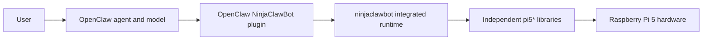
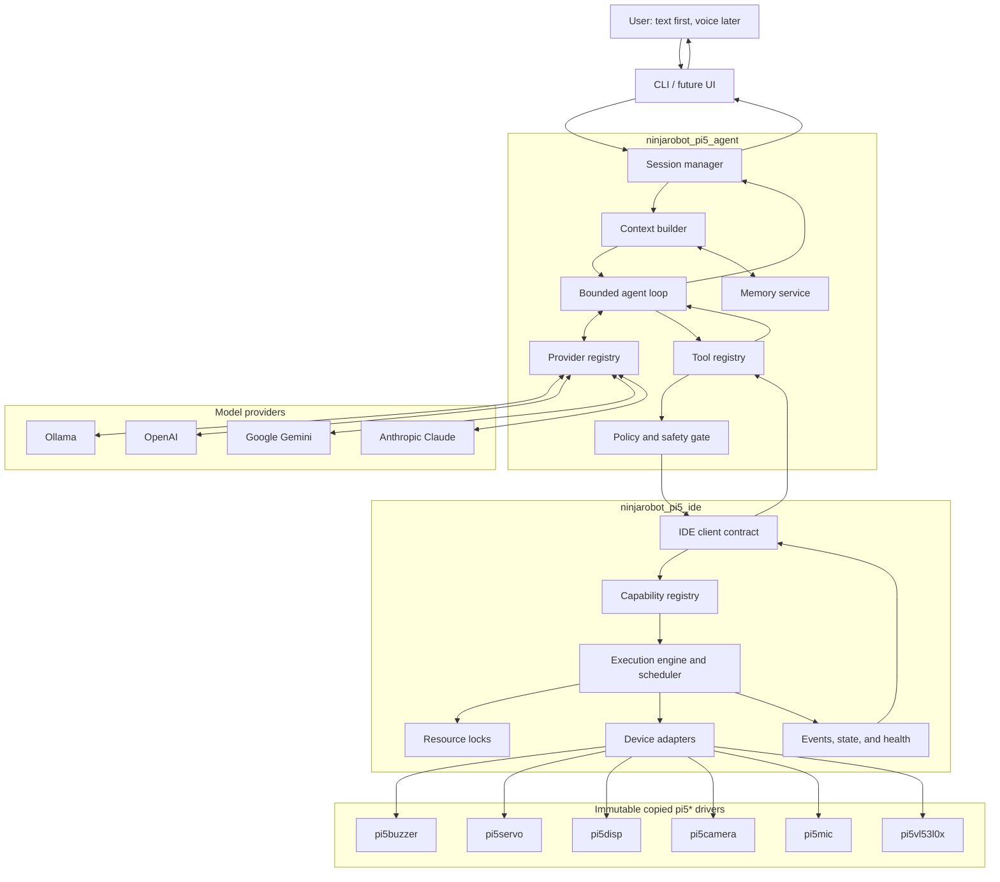
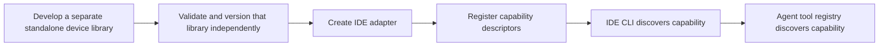
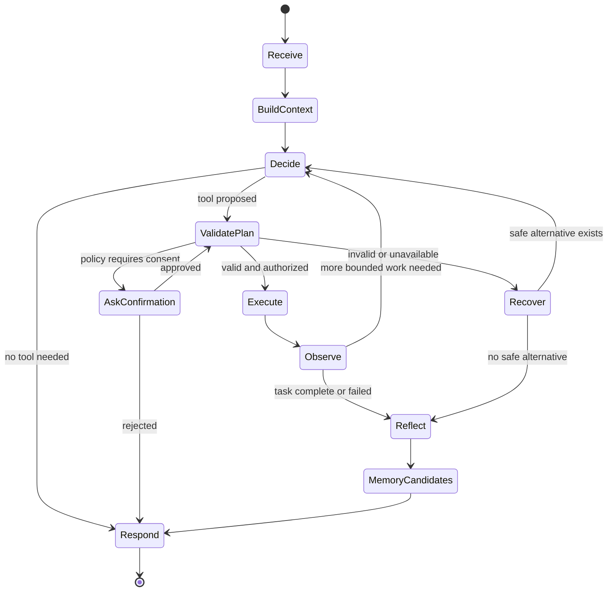
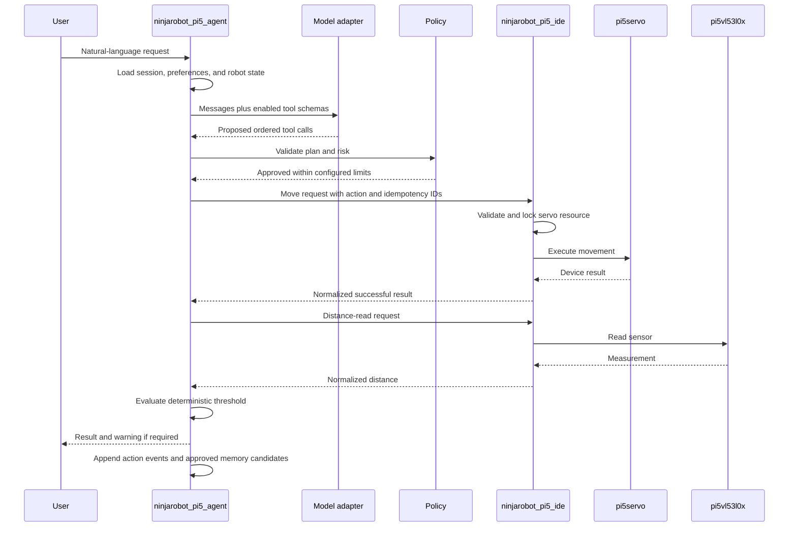

# NinjaRobotPi5V4 Implementation Plan

Status: Approved architecture and delivery plan
Last updated: 2026-07-23 (project and hardware decisions incorporated)
Primary development computer: Raspberry Pi 5, 8 GM RAM
Target computer: Raspberry Pi 5, 8 GB RAM
Implementation status: Phase 0 complete; Phase 1 approved

## 1. Purpose of this document

This is the single source of truth for building `NinjaRobotPi5V4`, formerly
planned under the name NinjaClawBot V4.
It explains what will be built, why the design is structured this way, how the
parts communicate, and how each phase will be validated.

The redesign has three main goals:

1. Replace the OpenClaw-based AI integration with a project-owned agent package
   named `ninjarobot_pi5_agent`.
2. Introduce a clean robot middleware package named `ninjarobot_pi5_ide`, so the AI
   agent never imports or controls a hardware driver directly.
3. Treat the copied `pi5*` drivers as immutable, independently usable Raspberry
   Pi 5 libraries. V4 integrates them through adapters without editing their
   source, tests, package metadata, or documentation.

This plan deliberately separates design from implementation. No V4 production
code should be written until this plan is approved. After approval, each phase
should be implemented and reviewed separately.

## 2. Plain-English glossary

The terms below are used throughout this plan.

- **Agent**: Software that receives a user request, decides what should happen,
  asks an AI model for help when useful, invokes approved tools, observes the
  result, and replies to the user.
- **AI model or LLM**: A large language model such as a local Ollama model or a
  cloud model from OpenAI, Google, or Anthropic.
- **Provider adapter**: A small translation layer that makes one AI provider
  conform to NinjaRobotPi5V4's common model interface.
- **Tool**: A typed operation that the model may request, such as reading the
  distance sensor or moving a servo. A tool request is only a proposal until
  deterministic application code validates and executes it.
- **Capability**: An operation offered by `ninjarobot_pi5_ide`. Tools are the
  agent-facing view of capabilities.
- **Middleware**: Software between the agent and device drivers. It gives the
  agent one consistent interface even though each device has a different
  low-level API.
- **Driver**: A `pi5*` library that talks to one kind of hardware.
- **Backend**: A replaceable implementation of an interface. V4 will use real
  hardware backends on the Pi and fake or simulated backends on macOS.
- **Schema**: A machine-readable description of valid inputs or outputs.
- **Idempotency key**: A unique identifier that prevents one requested action
  from being executed twice by accident.
- **Short-term memory**: Context used during the current conversation.
- **Long-term memory**: Project-owned, persistent data such as user preferences,
  task recipes, and summaries from earlier sessions.
- **ADR**: An Architecture Decision Record: a short document explaining a
  significant technical decision and its trade-offs.
- **Quality gate**: A required check, such as tests or linting, that must pass
  before a phase is accepted.

## 3. Sources reviewed

This plan is based on a full review of the current NinjaClawBot documentation,
source code, tests, all six `pi5*` libraries, the OpenClaw integration, and the
local `reachy_mini-main` reference project.

The NinjaClawBot review included:

- `README.md`
- `DevelopmentGuide.md`
- `InstallationGuide.md`
- `AGENTS.md`
- the workspace configuration and scripts
- `ninjaclawbot`
- `pi5buzzer`
- `pi5servo`
- `pi5disp`
- `pi5camera`
- `pi5mic`
- `pi5vl53l0x`
- `integrations/openclaw`

These are historical audit sources. NinjaRobotPi5V4 is a clean build and does
not include the old `ninjaclawbot` runtime or OpenClaw plugin.

The Reachy Mini review included its repository instructions, SDK documentation,
client façade, daemon, real/simulation/mock backends, command protocol,
application manager, application lock, JSON-RPC implementation, movement
handling, tests, and conversation-application templates.

The Reachy Mini repository itself is not a complete AI-agent or long-term-memory
implementation. Its conversation agent lives in a separate application. The
useful local lessons are its robot-control boundaries and application lifecycle,
not a memory system to copy.

For the OpenAI adapter, implementation should follow the current official
[Responses API](https://platform.openai.com/docs/api-reference/responses) and
[function calling guide](https://platform.openai.com/docs/guides/function-calling).
OpenAI-managed conversation state may be used inside that adapter, but it must
not replace V4's provider-neutral short-term or long-term memory.

### 3.1 Confirmed project decisions

The following decisions were confirmed on 2026-07-23 and are requirements, not
open design options:

- Product and repository name: `NinjaRobotPi5V4`
- Middleware import package: `ninjarobot_pi5_ide`
- Agent import package: `ninjarobot_pi5_agent`
- Unified command-line entry point: `ninjarobot_pi5_cli`
- Python baseline: Python 3.11
- Runtime topology: agent and IDE in one Python process
- Network topology: no HTTP daemon in the first release
- Interaction order: text CLI first, voice after the safety loop is stable
- Default model service: Ollama running directly on the Raspberry Pi 5
- Default target: Raspberry Pi 5 with 8 GB RAM, 256 GB NVMe, active cooling,
  Raspberry Pi OS Lite 64-bit, headless operation, and normal internet access
- Persistent memory: single local user, SQLite on the Pi, no raw microphone
  retention, and no camera-media retention unless explicitly requested
- Startup: manual by default; optional managed auto-start may be enabled later
- Hardware expansion board: DFRobot DFR0566 is mandatory
- Existing `pi5*` directories: independently usable hardware libraries.
  The project owner's 2026-07-25 authorization permits narrowly scoped,
  audited repairs after README review, failure reproduction, package-level
  linting/tests, and Raspberry Pi validation. Original import hashes remain
  permanent provenance, and repaired hashes must be recorded separately.
- Repository checkout path: `/home/rogerchang/NinjaRobotPi5` is the new V4
  root even though the product and repository name remain `NinjaRobotPi5V4`
- Historical reference: nested `NinjaClawBot/` is read-only, excluded from V4
  Git, and used only to inspect or export approved driver code
- Temporary MG90D continuous-rotation servos do not change the confirmed
  six-endpoint production topology; current test wiring uses DFR0566 digital
  GPIO12/GPIO13 breakouts and therefore native Raspberry Pi hardware PWM, not
  the HAT's dedicated I2C PWM0/PWM1 sockets

## 4. Current project: what exists today

At Phase 0 entry, the new `NinjaRobotPi5V4` root contained the implementation
plan and a nested historical `NinjaClawBot/` checkout. Phase 0 exports only the
six tracked `pi5*` library trees into the root, excludes the historical checkout
from V4 Git, and creates the clean workspace and root documentation. It does
not copy generated caches, the OpenClaw integration, or the old runtime.

The historical NinjaClawBot system used this flow:



The copied immutable libraries are the V4 hardware foundation:

| Library | Responsibility |
| --- | --- |
| `pi5buzzer` | Buzzer output and melodies |
| `pi5servo` | Servo control, groups, movement, and calibration |
| `pi5disp` | ST7789V display access |
| `pi5camera` | Camera capture and recognition-related operations |
| `pi5mic` | Microphone input and optional voice-input functions |
| `pi5vl53l0x` | VL53L0X distance measurement |

The historical `ninjaclawbot` package initializes the robot, loads movements and
expressions, coordinates multiple devices, and exposes action-oriented methods.
The OpenClaw plugin translates model tool calls into those actions.

In the historical design, OpenClaw owns model choice, tool-call orchestration,
and conversation behavior. This prevents the robot project from owning its complete
agent workflow and makes persistent, provider-neutral memory difficult.

## 5. Audit findings that V4 must address

The earlier audit found a healthy test baseline, but it also identified issues
that must be resolved before V4 relies on the affected paths.

### 5.1 Safety and correctness findings

1. A persistent OpenClaw tool timeout can retry a one-shot request. A hardware
   action may therefore happen twice even though the user requested it once.
   V4 must use action IDs and must never automatically retry a non-idempotent
   hardware operation when its outcome is uncertain.
2. A pending camera recognition identifier is used as a path component without
   sufficient validation. V4 must constrain identifiers and keep all generated
   paths inside an approved data directory.
3. The buzzer's worker and `off()` path can race. Shutdown and output ownership
   must be serialized.
4. VL53L0X calibration can fail without restoring the previous measurement
   offset. Calibration must use guaranteed cleanup.
5. A recognition backend is not consistently closed. Every device and backend
   must have an explicit lifecycle and safe teardown.
6. `pi5servo` contains version metadata that is not consistent across project
   surfaces. Package and runtime versions must have one source of truth.

### 5.2 Process and documentation findings

1. Some development instructions and actual commands have drifted apart.
2. Hardware and non-hardware validation are not consistently distinguished.
3. The OpenClaw TypeScript test path is less self-contained than the Python
   workspace.
4. Driver responsibilities are generally good, but integrated behavior and
   agent responsibilities are mixed in `ninjaclawbot`.

The copied drivers remain independent hardware libraries. V4 addresses
integration concerns at the adapter boundary: it validates camera identifiers,
serializes buzzer ownership, snapshots and restores sensor configuration around
calibration, owns backend teardown, records observed versions, and prevents
duplicate actions. Hardware-library defects may be repaired only under the
managed-driver workflow: review the library README, audit with Serena,
reproduce the root cause, make a focused fix, pass package lint/tests, validate
on the Pi, and record the changed hashes without replacing the import baseline.

### 5.3 Verified baseline

At the time of the audit:

- Python compilation passed.
- Ruff linting passed.
- 513 Python tests passed.
- OpenClaw TypeScript tests were not executed because their external
  dependencies were not installed in the audited environment.

This baseline should be recorded again at the start of Phase 0 so later changes
can be compared fairly.

## 6. Lessons adopted from Reachy Mini

Reachy Mini uses a client/server robot architecture with a stable SDK façade,
typed commands, replaceable real and simulation backends, explicit application
ownership, managed subprocess lifecycles, cancellation, and structured errors.

V4 should adopt these patterns:

- A stable façade hides low-level device differences.
- Real, fake, and future simulated backends implement the same contracts.
- The AI loop is outside the real-time device-control loop.
- Model-requested movements are queued and executed by deterministic code.
- Resource ownership prevents two operations from controlling one device at
  the same time.
- Long-running operations have IDs, progress, cancellation, and deadlines.
- Applications and devices have explicit start, health, stop, and close
  lifecycles.
- Protocol objects are typed and validated at the boundary.
- macOS development uses fakes; hardware-specific tests are marked and deferred
  to the Pi.
- Graceful shutdown is attempted first, followed by a bounded fallback.
- Tool descriptions are declarative and can be enabled by profile.

V4 should not copy these Reachy-specific elements:

- Reachy's kinematics, head pose, antenna, WebRTC, or app marketplace design.
- Its process and network complexity before NinjaRobotPi5V4 needs remote control.
- Provider-specific conversation behavior.
- Any assumption that Reachy's SDK supplies persistent memory; it does not.

## 7. V4 architectural principles

The following rules are mandatory.

1. The copied `pi5*` packages are immutable external boundaries inside this
   repository. V4 code and documentation must not modify them.
2. The agent never imports a `pi5*` package.
3. All robot operations go through `ninjarobot_pi5_ide`.
4. An AI model may select or propose a tool, but deterministic code validates
   policy, arguments, availability, ownership, timeout, and result.
5. A model provider is replaceable through an adapter.
6. Project-owned memory is provider-neutral and remains usable when the active
   model changes.
7. Robot configuration is authoritative configuration, not learned memory.
8. Non-idempotent hardware actions are not blindly retried.
9. All resources have explicit ownership and cleanup.
10. Every new hardware type is developed as an independent library outside the
    immutable copied drivers, then integrated through an IDE adapter. Agent
    tools are generated from registered capabilities.
11. V4 starts with one understandable agent loop. Multi-agent orchestration is
    out of scope until a proven use case justifies it.
12. macOS checks must never pretend to validate physical Raspberry Pi hardware.
13. Production servo pulses must be hardware-backed. GPIO12 and GPIO13 use the
    Pi 5 RP1 hardware-PWM path, never Python-timed or software PWM.
14. The DFR0566 and VL53L0X share I2C bus 1 at different addresses (`0x10` and
    `0x29` respectively).

## 8. Target architecture



There are two important planes:

- The **model plane** is probabilistic. It interprets language and proposes a
  plan or tool call.
- The **control plane** is deterministic. It enforces rules and operates the
  robot.

The control plane always has final authority.

## 9. Proposed repository layout

The product name is `NinjaRobotPi5V4`. Python import packages and the unified
CLI use the exact confirmed underscore names below.

```text
NinjaRobotPi5V4/
├── pyproject.toml
├── uv.lock
├── README.md
├── AGENTS.md
├── DevelopmentGuide.md
├── DevelopmentLog.md
├── InstallationGuide.md
├── tests/
├── ninjarobot_pi5_ide/
│   ├── pyproject.toml
│   ├── src/ninjarobot_pi5_ide/
│   │   ├── api/
│   │   ├── capabilities/
│   │   ├── adapters/
│   │   ├── execution/
│   │   ├── lifecycle/
│   │   ├── errors.py
│   │   ├── models.py
│   │   └── cli.py
│   └── tests/
├── ninjarobot_pi5_agent/
│   ├── pyproject.toml
│   ├── src/ninjarobot_pi5_agent/
│   │   ├── agent/
│   │   ├── providers/
│   │   ├── tools/
│   │   ├── memory/
│   │   ├── policy/
│   │   ├── sessions/
│   │   ├── config/
│   │   └── cli.py
│   └── tests/
├── pi5buzzer/
├── pi5servo/
├── pi5disp/
├── pi5camera/
├── pi5mic/
├── pi5vl53l0x/
├── docs/
│   ├── architecture/
│   ├── adr/
│   ├── validation/
│   └── hardware/
└── NinjaRobotPi5V4_ImplementationPlan.md
```

The new root does not copy `ninjaclawbot` or `integrations/openclaw`. Historical
behavior may be studied as a reference, but V4 does not provide a legacy
runtime-compatibility layer.

## 10. Layer 1: immutable `pi5*` libraries

### 10.1 Responsibility

Each copied driver is treated as an already delivered standalone dependency.
Its existing public surface may be used, but the V4 project does not change it.
Conceptually, each driver owns:

- device-specific configuration
- hardware communication
- validation of physical input ranges
- device lifecycle
- device-specific errors
- a fake backend suitable for non-hardware tests where practical
- a CLI or script for focused manual device tests

Some copied packages contain historical integration features. In particular,
`pi5mic` contains OpenClaw transport/session code and model-based transcription.
Because the package is immutable, those modules remain on disk, but
NinjaRobotPi5V4 must not import, configure, invoke, or document them as V4
features. The IDE adapter uses only the approved device-facing portions.

### 10.2 Compatibility rule

Existing public imports, methods, tests, READMEs, package metadata, and lockfiles
are preserved byte-for-byte. If V4 needs a different behavior, it implements a
wrapper, policy, validator, or compatibility object in `ninjarobot_pi5_ide`.
If containment is unsafe or impossible, the capability remains disabled.

### 10.3 Driver lifecycle

The IDE adapts each driver's existing methods into this common conceptual
lifecycle without changing the driver:

```text
create -> open/initialize -> ready -> operate -> stop -> close
```

The adapter makes repeated close requests safe, uses context managers where the
existing driver supports them, and owns cleanup after partial initialization.

### 10.4 Hardware and fake backends

Fakes belong to the new IDE test package, not inside the immutable drivers. A
fake must be deterministic, record commands for assertions, and clearly label
results as simulated. Production servo control remains hardware-backed.

## 11. Layer 2: `ninjarobot_pi5_ide`

### 11.1 Purpose

`ninjarobot_pi5_ide` is the only robot-control surface available to the agent.
It is a clean implementation; it does not depend on the historical
`ninjaclawbot` runtime.

The first implementation should be an in-process Python API plus a CLI. The API
must remain transport-neutral, but the first release has no HTTP daemon or
separate IDE process. A future transport requires a demonstrated need and an
approved ADR.

### 11.2 Core components

#### Capability registry

Stores the operations currently available, their schemas, risk, device
requirements, and runtime health.

#### Device adapters

Translate common capability requests into one driver's API. An adapter imports
one or more `pi5*` libraries; the agent does not.

#### Execution engine

Validates a request, acquires resources, invokes the adapter, records progress,
normalizes the result, and releases resources.

#### Action scheduler

Queues actions that cannot safely overlap. It supports deadlines, cancellation,
and explicit concurrency only when resource sets do not conflict.

#### Resource locks

Provide exclusive ownership for resources such as:

- `servo_bus`
- `camera`
- `display`
- `microphone`
- `buzzer`
- `distance_sensor`

Cross-device behaviors acquire all required resources in a deterministic order
to avoid deadlocks.

#### Lifecycle manager

Initializes configured devices, reports unavailable optional devices, shuts
down safely, and makes partial startup failures visible.

#### State and event service

Provides current availability, action progress, cancellation, health, and
recent structured events.

### 11.3 Main contracts

The exact Python syntax will be finalized in Phase 1, but the conceptual
contracts are:

```python
class CapabilityAdapter(Protocol):
    def descriptors(self) -> list[CapabilityDescriptor]: ...
    async def execute(
        self,
        request: ActionRequest,
        context: ExecutionContext,
    ) -> ActionResult: ...
    async def close(self) -> None: ...
```

```python
@dataclass(frozen=True)
class CapabilityDescriptor:
    name: str
    version: str
    description: str
    input_schema: dict[str, object]
    output_schema: dict[str, object]
    risk: RiskLevel
    resources: tuple[str, ...]
    default_timeout_seconds: float
    idempotent: bool
    cancellable: bool
    confirmation_required: bool
```

```python
@dataclass(frozen=True)
class ActionRequest:
    action_id: str
    capability: str
    arguments: dict[str, object]
    requested_by: str
    session_id: str
    deadline: datetime | None
    idempotency_key: str
```

```python
@dataclass(frozen=True)
class ActionResult:
    action_id: str
    status: ActionStatus
    data: dict[str, object] | None
    error: IDEError | None
    started_at: datetime
    finished_at: datetime
    retry_safety: RetrySafety
```

### 11.4 Standard error model

Every error should contain:

- a stable code
- a beginner-readable message
- an optional technical detail for logs
- whether the request was definitely not executed
- whether retry is safe
- the affected capability and action ID

Initial error categories:

| Code family | Meaning | Normal response |
| --- | --- | --- |
| `INVALID_*` | Input failed schema or range checks | Correct input; do not execute |
| `UNAVAILABLE_*` | Device or capability is unavailable | Offer an alternative |
| `BUSY_*` | Resource is owned by another action | Wait or cancel explicitly |
| `TIMEOUT_BEFORE_START` | Action never started | Retry may be safe |
| `OUTCOME_UNKNOWN` | Timeout/disconnect after action began | Do not auto-retry |
| `DEVICE_*` | Driver reported a device failure | Stop affected workflow |
| `CANCELLED` | User or policy cancelled the action | Return current safe state |
| `POLICY_DENIED` | Safety policy rejected it | Explain the rule |
| `INTERNAL_*` | Unexpected IDE failure | Log correlation ID; fail closed |

### 11.5 IDE CLI

The CLI exists for developers and manual testing, independent of the AI agent.
The root workspace registers the exact console-script name
`ninjarobot_pi5_cli`, pointing to the agent CLI. IDE-only subcommands delegate
through the in-process IDE API. Proposed commands:

```text
ninjarobot_pi5_cli capabilities list
ninjarobot_pi5_cli health
ninjarobot_pi5_cli action run <capability> --json '<arguments>'
ninjarobot_pi5_cli action status <action-id>
ninjarobot_pi5_cli action cancel <action-id>
ninjarobot_pi5_cli device list
ninjarobot_pi5_cli config validate
ninjarobot_pi5_cli --dry-run ...
```

`--dry-run` uses fake adapters and clearly labels every result as simulated.

### 11.6 Adding new hardware

The supported workflow will be:



The copied six `pi5*` directories remain untouched. A future driver is added as
a separate, approved dependency and then registered through a new IDE adapter.
No provider-specific prompt or agent source file should need editing when a
properly described capability is added. Profiles and policy may still choose
whether the new capability is enabled.

## 12. Layer 3: `ninjarobot_pi5_agent`

### 12.1 Purpose

The agent owns interaction, model selection, context, planning, tool-call
coordination, recovery, memory, and the final reply. It does not own hardware.

### 12.2 Bounded agent workflow

V4 should use an explicit state machine instead of an unbounded autonomous loop.



Each turn has:

- a maximum number of model calls
- a maximum number of tool calls
- a wall-clock deadline
- a cancellation token
- a budget for context and output
- a trace/correlation ID

The initial default should favor short plans and one action at a time. Complex
parallel robot actions are allowed only when the IDE explicitly declares that
their resources do not conflict.

### 12.3 Planning and reasoning

The agent should request a concise, structured execution plan, not expose hidden
model reasoning. A plan contains:

- the understood goal
- assumptions visible to the user when important
- ordered steps
- proposed tools and arguments
- required confirmations
- completion criteria

The application validates the structured plan. Free-form model text never
becomes a hardware command.

### 12.4 Tool registry

The tool registry converts enabled IDE capability descriptors into
provider-neutral tool definitions. It normalizes each provider's tool-call
format back into the same `ToolCall` object.

A tool definition contains:

- stable name and version
- plain-language description
- JSON input schema
- expected output schema
- risk and confirmation requirements
- availability
- timeout
- idempotency and cancellation information

Profiles can enable a safe subset, for example:

```text
default: distance, display, simple motion, buzzer
observer: read-only camera and sensors
maintenance: calibration and diagnostics with confirmation
voice: microphone plus default capabilities
```

### 12.5 Safety policy

Initial risk levels:

| Level | Examples | Default behavior |
| --- | --- | --- |
| `READ_ONLY` | Read distance, health, or state | Execute if available |
| `LOW` | Display text, short quiet beep | Execute within limits |
| `MOTION` | Move a servo or run an expression | Check limits and workspace |
| `PRIVACY` | Capture image or audio | Require visible policy/consent |
| `MAINTENANCE` | Calibration or raw diagnostics | Require explicit confirmation |
| `EMERGENCY` | Stop, release, safe shutdown | Always locally available |

The policy engine must be ordinary deterministic Python, covered by table-driven
tests. The model cannot lower a risk level or bypass confirmation.

### 12.6 Error and recovery behavior

Recovery must depend on what is known:

| Situation | Agent behavior |
| --- | --- |
| Invalid arguments | Correct once from schema feedback |
| Capability unavailable | Explain and offer an available alternative |
| Resource busy | Wait only within the turn deadline or ask the user |
| Timeout before action started | One bounded retry may be allowed |
| Outcome unknown after action started | Observe state; never repeat blindly |
| Device failure | Stop related steps and move to a safe state if possible |
| Provider timeout | Retry provider request within policy or use configured fallback |
| Provider tool format invalid | Reject it and request corrected structured output once |
| User cancellation | Propagate cancellation to IDE and report final known state |
| Memory write failure | Complete the user task; report/log memory degradation |

Provider fallback must not repeat already-started robot actions. The durable
action ledger is consulted before continuing a turn with another model.

## 13. Model provider architecture

### 13.1 Provider-neutral interface

```python
class LLMProvider(Protocol):
    @property
    def capabilities(self) -> ProviderCapabilities: ...

    async def generate(self, request: ModelRequest) -> ModelTurn: ...

    async def stream(
        self,
        request: ModelRequest,
    ) -> AsyncIterator[ModelEvent]: ...

    async def health(self) -> ProviderHealth: ...

    async def close(self) -> None: ...
```

`ModelRequest` contains provider-neutral messages, tool schemas, model settings,
and correlation metadata. `ModelTurn` contains normalized text, tool calls,
usage, finish reason, and provider diagnostics.

### 13.2 Planned adapters

| Adapter | Role |
| --- | --- |
| Ollama | Default local provider running on the Raspberry Pi 5 |
| OpenAI | Cloud models through the current Responses API |
| Google Gemini | Cloud Gemini models |
| Anthropic | Cloud Claude models |
| Fake provider | Deterministic tests with scripted responses |

No model identifier is hard-coded into the core. Configuration selects provider
and model. Each adapter declares whether it supports native tool calling,
streaming, images, audio, structured output, usage reporting, and provider-side
conversation state.

The first Ollama profile must be benchmarked and tuned for the confirmed 8 GB
Pi. Initial defaults should favor a small quantized model, bounded context,
bounded output, and one model request at a time. The exact model and
quantization are selected from measured Pi results rather than assumed in this
plan. Larger models may be selectable but are not part of the minimum hardware
acceptance target.

### 13.3 Configuration

A non-secret TOML configuration is recommended:

```toml
[agent]
default_provider = "ollama"
fallback_providers = []
max_model_turns = 6
max_tool_calls = 8
turn_timeout_seconds = 90

[providers.ollama]
model = "configured-by-user"
base_url = "http://127.0.0.1:11434"
max_loaded_models = 1

[providers.openai]
model = "configured-by-user"
api_key_env = "OPENAI_API_KEY"

[memory]
database_path = "./data/ninjarobot_pi5.sqlite3"

[profile]
name = "default"
```

API keys must come from environment variables, an operating-system key store,
or a separate secret manager. They must not be committed to TOML, SQLite,
logs, prompts, or action events.

### 13.4 Provider selection and fallback

Provider selection is explicit. Ollama on `127.0.0.1` is the default and must
work on the 8 GB Pi without a cloud credential. A setup command should show
available adapters, check health, and save the user's choice. LAN-hosted Ollama
is not required for the first release, although the configurable base URL keeps
that future option inexpensive.

Fallback is allowed for language generation when configured, but only at a
safe boundary. Before a fallback model continues a tool-using turn, it receives
the action ledger and observed results so it cannot assume an action failed and
repeat it.

### 13.5 Adding a provider

A new provider requires:

1. one adapter implementing `LLMProvider`
2. capability metadata
3. configuration validation
4. contract tests using recorded or fake provider responses
5. optional live tests excluded from the default suite
6. documentation

It must not require changes to memory storage, IDE adapters, or core tool
execution.

## 14. Persistent memory design

### 14.1 What belongs in memory

V4 needs several distinct stores:

| Store | Lifetime | Examples |
| --- | --- | --- |
| Current turn | One request | Parsed intent and pending tool result |
| Session context | One conversation | Recent messages and active plan |
| User profile | Long term | Name, preferred language, response style |
| Preferences | Long term | Quiet buzzer, preferred local model |
| Task recipes | Long term | A user-approved sequence used frequently |
| Episodic summaries | Long term | Concise summaries of useful past sessions |
| Action ledger | Durable audit | Requested, started, finished, cancelled actions |
| Robot configuration | Authoritative config | Pins, limits, enabled devices |

Robot configuration is not learned memory. The model may propose a configuration
change, but an approved configuration service performs and records it.

### 14.2 Storage choice

SQLite is the recommended first persistent store because it is local,
transactional, available on macOS and Raspberry Pi, easy to back up, and does
not require a server.

The first retrieval system should use structured queries plus SQLite FTS5 text
search. Semantic vector retrieval can be added behind a `MemoryIndex` interface
later. V4 does not need a vector database to ship its first reliable version.

Recommended tables:

```text
schema_migrations
users
preferences
sessions
messages
memory_items
task_recipes
action_events
memory_audit_events
```

Every memory item includes owner/scope, kind, content, source, confidence,
creation time, update time, optional expiry, and sensitivity.

### 14.3 Memory write workflow


The model may suggest a memory candidate, but it never writes directly to the
database. Deterministic code checks type, size, scope, consent, duplicates, and
sensitive data.

### 14.4 Memory retrieval

The context builder retrieves only a small, relevant set:

1. authoritative robot state/configuration
2. current session messages or summary
3. explicit user preferences
4. relevant task recipes
5. a bounded number of episodic memories

Retrieved items retain provenance so the agent can distinguish a user-stated
preference from a low-confidence inferred behavior.

### 14.5 User control and privacy

The CLI must support:

```text
ninjarobot_pi5_cli memory list
ninjarobot_pi5_cli memory show <id>
ninjarobot_pi5_cli memory forget <id>
ninjarobot_pi5_cli memory export
ninjarobot_pi5_cli memory clear-session <id>
```

Deletion is an application operation with an audit event. Secrets, raw
credentials, and raw microphone audio are not stored as ordinary memory.
Camera media is not retained unless the user explicitly requests it. Any media
retention needs a separate opt-in policy.

### 14.6 Provider state is not long-term memory

Some cloud APIs can maintain conversation objects between responses. That can
reduce adapter work for a live session, but:

- it is provider-specific
- retention and privacy rules differ
- it may not be available offline
- it does not contain IDE action truth
- switching providers would lose it

Therefore, V4's own session store and action ledger remain authoritative.

## 15. End-to-end data flow

Example: “Look left, and if something is closer than 20 cm, warn me.”



The distance comparison should be deterministic application logic, not a second
model guess.

## 16. Observability and operations

Use structured logs with:

- timestamp
- severity
- component
- session ID
- turn ID
- action ID
- capability
- provider
- stable error code

Prompts and model output may contain private data, so full prompt logging is off
by default. Development logs should use redaction.

Useful local metrics:

- provider latency and failures
- tool-call validation failures
- action queue time and duration
- device health changes
- cancellations
- unknown-outcome events
- memory retrieval and write failures

A single `health` command should summarize agent, provider, IDE, drivers,
database, and optional devices without invoking dangerous hardware behavior.

## 17. Configuration and deployment

Configuration precedence should be:

```text
safe built-in defaults
  < project/system configuration
  < user configuration
  < explicit CLI argument
```

Secret values are resolved separately and never printed by configuration
inspection.

The deployment baseline is:

- Raspberry Pi 5 with 8 GB RAM
- 256 GB NVMe storage
- active cooling
- Raspberry Pi OS Lite 64-bit
- Python 3.11
- headless operation
- normal internet access
- Ollama running locally on the Pi
- agent and IDE running in one Python process
- writable application data on the NVMe drive
- explicit device permissions
- shutdown hooks that cancel work and close adapters

The application starts manually by default. An optional systemd service may be
provided and enabled manually, but installation must not silently enable
auto-start. A separate IDE service, HTTP daemon, or other network transport
requires a later ADR and contract tests.

## 18. Clean-build and reference strategy

NinjaRobotPi5V4 is not an in-place migration of the old runtime:

1. Record the copied driver baseline without changing it.
2. Remove only generated cache artifacts copied into the new root.
3. Create new root workspace files and the two new V4 packages.
4. Build IDE adapters around the existing public driver contracts.
5. Reimplement only the integrated robot behaviors V4 actually needs.
6. Build and validate `ninjarobot_pi5_agent`.
7. Compare useful historical behavior through tests and documentation, without
   importing or shipping the old runtime.

The old NinjaClawBot repository remains an external historical reference and
rollback source. OpenClaw modules that happen to remain inside immutable
`pi5mic` are never used by V4.

## 19. Testing strategy

### 19.1 Test layers

| Test type | Runs on macOS | Runs on Pi | Purpose |
| --- | --- | --- | --- |
| Unit tests with fakes | Yes | Yes | Pure behavior and error paths |
| Contract tests | Yes | Yes | Every adapter obeys the common interface |
| Agent scenario tests | Yes | Yes | Scripted model/tool conversations |
| IDE dry-run integration | Yes | Yes | Multi-component flow without hardware |
| Provider live tests | Optional | Optional | Verify external API compatibility |
| Driver hardware tests | No | Yes | Verify real devices |
| Full robot acceptance | No | Yes | Validate safety and end-to-end behavior |

Hardware tests must have explicit pytest markers and must not run in the default
macOS suite.

### 19.2 Deterministic agent scenarios

The fake model provider should script:

- direct answer with no tool
- one successful tool
- multi-step tool sequence
- invalid tool arguments
- unavailable capability
- confirmation required
- user cancellation
- provider timeout before any action
- provider failure after an action succeeds
- IDE timeout with unknown outcome
- repeated tool call with the same idempotency key
- memory write rejected by privacy policy

### 19.3 Quality gates

The normal workspace gate after relevant code changes is:

```bash
uv run --extra dev python -m compileall \
  ninjarobot_pi5_ide/src ninjarobot_pi5_agent/src

uv run --extra dev ruff check \
  ninjarobot_pi5_ide ninjarobot_pi5_agent tests
uv run --extra dev ruff format --check \
  ninjarobot_pi5_ide ninjarobot_pi5_agent tests
uv run --extra dev pytest tests ninjarobot_pi5_ide/tests ninjarobot_pi5_agent/tests
```

If static typing is adopted in Phase 1, its command becomes a required gate for
new V4 packages. The immutable `pi5*` packages retain their own package-local
commands. Phase 0 records those baseline results; later V4 gates do not format,
rewrite, or silently update the copied packages.

Every phase also requires:

- focused tests for changed modules
- `git diff --check`
- documentation review
- no unexplained decrease in the baseline test count
- a recorded result for each required gate

## 20. Confirmed hardware profile

### 20.1 Bus and pin allocation

| Function | Confirmed connection | V4 rule |
| --- | --- | --- |
| Passive buzzer | BCM GPIO27 | Use the existing `pi5buzzer` API |
| Direct servo 1 | BCM GPIO12 | RP1 hardware PWM; endpoint `gpio12` |
| Direct servo 2 | BCM GPIO13 | RP1 hardware PWM; endpoint `gpio13` |
| HAT servo 1 | DFR0566 physical PWM0 | Endpoint `hat_pwm1` |
| HAT servo 2 | DFR0566 physical PWM1 | Endpoint `hat_pwm2` |
| HAT servo 3 | DFR0566 physical PWM2 | Endpoint `hat_pwm3` |
| HAT servo 4 | DFR0566 physical PWM3 | Endpoint `hat_pwm4` |
| DFR0566 control | I2C bus 1, address `0x10` | Mandatory expansion board |
| VL53L0X | I2C bus 1, address `0x29` | One sensor; shared bus |
| Display data | SPI0, CE0, MOSI GPIO10, SCLK GPIO11, CE0 GPIO8 | 32 MHz initial setting |
| Display control | DC GPIO4, RST GPIO5, BL GPIO6 | Rotation 90°, brightness 75% |
| Camera | Raspberry Pi CSI camera through Picamera2 | 1280×720 initial capture |
| Microphone | Default USB audio input | 16 kHz, mono |

No other UART, I2S, SPI, or HAT interface is currently in scope.

The user's phrase “software PWM pin 12 and 13” is normalized here to **RP1
hardware PWM on GPIO12 and GPIO13**. Python-timed/software PWM is prohibited for
production servo control. The Pi firmware must enable the matching two-channel
PWM overlay, and signal accuracy is verified on the Pi with a logic analyzer or
oscilloscope before a servo is attached.

Planned Raspberry Pi firmware setting:

```ini
dtoverlay=pwm-2chan,pin=12,func=4,pin2=13,func2=4
```

This setting is applied only during the later Pi setup phase, never on the
macOS development computer.

### 20.2 DFR0566 servo topology

DFRobot's official DFR0566 documentation states that:

- the board provides four PWM ports, PWM0 through PWM3
- its on-board STM32 generates those PWM signals
- the Raspberry Pi controls them over I2C
- the board exposes Raspberry Pi I2C, SPI, UART, I2S, and BCM-numbered digital
  connections
- its external PWM-power input is specified as 6–12 V

References:

- [DFR0566 official getting-started guide](https://wiki.dfrobot.com/dfr0566/docs/22892)
- [DFR0566 official product page](https://www.dfrobot.com/product-1930.html)

The four HAT servos therefore use the DFR0566's MCU-managed PWM ports, while
the two GPIO12/GPIO13 servos use the Pi's independent RP1 hardware PWM.

The exact servo models and their rated voltage/current are still required
before hardware power-on. The DFR0566 documentation indicates that external VP
power is presented to the PWM-port supply rail. A 6–12 V supply must not be
connected to a servo that is not rated for that voltage. The Pi checklist must
record:

- all six servo models
- each servo's rated voltage and stall current
- selected supply voltage and continuous/peak current rating
- fuse or current-limiting arrangement
- common-ground arrangement
- emergency power-disconnect procedure

Until those values are recorded and reviewed, HAT servo power validation is
blocked even though adapter development with fakes may proceed.

### 20.3 Display orientation

The required display orientation is 90° horizontal with brightness set to 75%.
The copied driver source defaults to 90°, while its copied `display.json`
contains 0°. Because `pi5disp` is immutable, V4 does not edit that file. The
IDE's V4-owned robot configuration explicitly requests DC GPIO4, reset GPIO5,
backlight GPIO6, rotation 90°, and brightness 75% when constructing or invoking
the display.

### 20.4 Hardware-owned V4 configuration

The V4 root keeps its own authoritative robot configuration. It records the
confirmed mapping above and passes values to driver constructors or adapter
calls. It does not rewrite configuration files inside the copied libraries.

### 20.5 Remaining hardware-record items

The logical topology is confirmed, but these electrical or product identifiers
must be recorded before the corresponding powered Pi checklist:

- passive-buzzer module voltage/current and whether a transistor driver is used
- exact ST7789V board revision, supply voltage, and backlight polarity
- exact Raspberry Pi camera module and CSI connector, including confirmation
  that continuous autofocus is supported
- exact USB microphone model and ALSA device identity
- whether speaker/audio output is required in a later phase
- the six servo models and the complete supply design listed in Section 20.2

These items do not block root scaffolding, contracts, fakes, or macOS adapter
development. They do block production hardware certification for the affected
capability.

### 20.6 Live Pi observations recorded on 2026-07-25

The pre-Phase-1 hardware run recorded:

- Raspberry Pi 5 Model B Rev 1.1, Debian 13, kernel 6.18.34
- DFR0566 detected at I2C `0x10`
- VL53L0X detected at `0x29` with correct identification registers, but the
  immutable driver times out during reference calibration
- OV5647 camera detected at `0x36`; native capture works, but Picamera2 is not
  available to the Python environment used by `pi5camera`
- USB PnP Sound Device detected; native mono capture works at 44.1 kHz, while
  `pi5mic` is blocked by missing PortAudio and local Whisper assets
- temporary MG90D servos are connected to GPIO12/GPIO13 through the HAT's
  header passthrough, use a reported 5 V supply, and were not moved because no
  accessible emergency disconnect exists
- buzzer command paths and both servo backend probes completed
- display command paths completed; visual sign-off is still required

The complete evidence and rollback record is
`docs/validation/raspberry-pi-hardware-validation-2026-07-25.md`.

## 21. Raspberry Pi 5 validation policy

No hardware validation will be run during macOS development. A phase that
changes hardware-facing behavior produces a Pi checklist, expected results,
safety notes, and a pass/fail report template.

The checklist is executed later on a Raspberry Pi 5 by an authorized operator.
Implementation can proceed on macOS through fake and contract tests, but a
hardware-facing phase is not production-certified until its Pi checklist
passes.

General Pi safety:

- verify wiring and voltage before powering devices
- begin servo tests with conservative angles and no mechanical load
- keep an accessible power cutoff
- use short buzzer output at low duty where supported
- avoid storing unintended camera or microphone media
- verify sensor cleanup after failures and cancellation
- test one device before cross-device behaviors

## 22. Phased implementation plan

Each phase requires approval before coding begins. A phase is complete only
when its deliverables, macOS gates, documentation, and any required deferred Pi
checklist are present.

### Phase 0: Clean root, immutable baseline, and project governance

**Objective**

Create a clean, reproducible NinjaRobotPi5V4 workspace without modifying any
copied driver.

**Deliverables**

- Remove copied `__pycache__`, `.pytest_cache`, and `.ruff_cache` artifacts.
- Add root `README.md`, `AGENTS.md`, `.gitignore`, `pyproject.toml`, and
  workspace `uv.lock`.
- Add `DevelopmentGuide.md` and `DevelopmentLog.md`.
- Record checksums or Git tree state for every immutable `pi5*` directory.
- Record current package versions, exports, tests, CLI behavior, and assets.
- Add an architecture-decision directory and ADR template.
- Add root-owned hardware markers and baseline scripts without editing
  driver-local tests.
- Add an immutable-driver policy to `AGENTS.md`.
- Add an adapter containment matrix for every known audit finding.
- Add the confirmed hardware mapping and unresolved servo-power record.
- Record historical behavior used for comparison without copying the old
  OpenClaw or `ninjaclawbot` runtimes.

**Pi validation**

- Run and record each copied package's existing test and lint commands without
  changing failures or formatting its files.
- Validate the root workspace and documentation.
- Verify copied driver checksums are unchanged after all Phase 0 commands.
- No physical-device test.

**Exit criteria**

- Baseline report is committed.
- Every copied driver is demonstrably unchanged.
- Known driver risks have a wrapper containment rule or a disabled-capability
  decision.
- Root governance and naming use `NinjaRobotPi5V4` consistently.
- Servo hardware power remains explicitly blocked until its electrical record
  is complete.

### Phase 1: V4 contracts and package skeletons

**Objective**

Define stable boundaries before migrating behavior.

**Deliverables**

- Add `ninjarobot_pi5_ide` and `ninjarobot_pi5_agent` packages.
- Add unified `ninjarobot_pi5_cli` entry point.
- Define capability, action, result, error, provider, tool, session, and memory
  contracts.
- Add fake IDE, fake provider, fake clock, and deterministic ID helpers.
- Choose validation library and static typing policy through ADRs.
- Add root workspace sources, test paths, and commands.
- Add configuration schema with secret references.

**Pi validation**

- Contract unit tests.
- Serialization round-trip tests.
- Configuration validation tests.
- Compile, Ruff, formatting, pytest, and selected type checking.

**Exit criteria**

- No agent package imports a driver.
- Contract documentation includes examples and error semantics.
- Copied driver checksums remain unchanged.

### Phase 2: IDE core and one reference adapter

**Objective**

Build the capability registry, lifecycle, scheduler, resource locks, action
ledger, dry-run CLI, and one simple adapter end to end.

The recommended first adapter is `pi5vl53l0x` because a read-only sensor
capability is easier to validate safely than motion.

**Deliverables**

- IDE registry and adapter discovery.
- Execution engine and durable action records.
- Resource ownership and bounded queue.
- Standard errors and health.
- CLI commands and fake backend.
- Distance sensor adapter.

**Pi validation**

- Race, cancellation, timeout, idempotency, and lifecycle tests with fakes.
- CLI tests.
- Unknown-outcome behavior tests.
- Full workspace gates.
- Initialize, read, timeout, close, restart, and repeated-read checks for
  VL53L0X.

**Exit criteria**

- A dry-run action and a real-adapter contract share identical result shapes.
- Repeating an action ID cannot duplicate execution.

### Phase 3: Integrate all immutable device libraries through IDE adapters

**Objective**

Add adapters incrementally without changing the copied standalone libraries.

**Order**

1. `pi5buzzer`
2. `pi5disp`
3. `pi5servo`
4. `pi5camera`
5. `pi5mic`

Each device is its own subphase and review.

The servo subphase has a fixed six-servo topology:

- `gpio12` and `gpio13` use the Pi 5 RP1 hardware-PWM backend
- `hat_pwm1` through `hat_pwm4` map to DFR0566 physical PWM0 through PWM3
- the DFR0566 uses I2C bus 1 at address `0x10`
- the adapter must create or select the copied library's supported mixed
  hardware backend without changing `pi5servo`
- every servo begins at its safe calibrated center and is validated one at a
  time before group motion
- group motion is disabled until all six calibrations and the electrical power
  record are approved

**Deliverables per device**

- Capability descriptors.
- Adapter and fake.
- CLI manual-test command.
- Resource and risk classification.
- Lifecycle, cancellation, and error tests.
- Documentation and deferred Pi checklist.

**Pi validation**

- Existing driver tests run as immutable baselines; all new tests live in V4
  root or IDE test directories.
- Adapter contract tests.
- Cross-device lock-order tests as resource combinations grow.
- Full workspace gates after every subphase.
- One device-specific checklist after every subphase.
- No full-robot behavior until individual device checks pass.

**Exit criteria**

- Every current device is available through the IDE.
- The agent-facing layer has no direct driver import.
- Checksums prove that all six copied driver directories remain unchanged.

### Phase 4: Integrated V4 robot behaviors

**Objective**

Implement the cross-device expressions, movements, asset loading, and robot
initialization required by V4. Historical behavior may inform requirements, but
no old runtime code is imported.

**Deliverables**

- Behavior capability adapter.
- Safe multi-resource acquisition.
- Asset repository with validated identifiers and paths.
- V4 behavior catalog and schema.
- Reference matrix covering deliberately retained historical actions and
  expressions.

**Pi validation**

- New V4 behavior and integration tests.
- Immutable driver baseline remains separately recorded.
- Asset and path security tests.
- Multi-device fake scenarios.
- Conservative expression and movement checks.
- Cancellation midway through behavior.
- Shutdown and resource release after forced failure.

**Exit criteria**

- Approved V4 behavior works through IDE APIs.
- No V4 package imports `ninjaclawbot` or OpenClaw.

### Phase 5: Agent core and Ollama adapter

**Objective**

Implement the bounded agent state machine with Ollama running locally on the
confirmed 8 GB Raspberry Pi 5 and no required cloud dependency.

**Deliverables**

- Session manager and context builder.
- Plan/tool/result normalized models.
- Tool registry generated from IDE descriptors.
- Policy and confirmation engine.
- Fake provider and Ollama adapter.
- Text CLI.
- Recovery matrix implementation.
- Pi-oriented model configuration with bounded context, output, concurrency,
  and memory use.
- Benchmark command that records model load time, first-token latency,
  tool-call correctness, peak memory, temperature, and throttling.

**Pi validation**

- All deterministic agent scenarios.
- Property/table tests for policy.
- Malformed model output and loop-bound tests.
- Provider unavailability and cancellation tests.
- Full workspace gates.
- Text request to safe read-only capability.
- Confirmed motion request.
- Model failure before and after a hardware action.
- Emergency stop without model availability.
- Sustained local Ollama run under active cooling with no thermal throttling or
  memory exhaustion.

**Exit criteria**

- Local Ollama on the 8 GB Pi can complete safe tool tasks within the accepted
  benchmark thresholds recorded during this phase.
- The loop always terminates within configured bounds.
- No provider code imports a driver.

### Phase 6: Cloud provider adapters

**Objective**

Add OpenAI, Gemini, and Anthropic without changing the agent or IDE contracts.

**Deliverables**

- OpenAI Responses API adapter.
- Gemini adapter.
- Anthropic adapter.
- Provider capability matrix and setup/health CLI.
- Secret-loading and redaction tests.
- Optional provider fallback at safe boundaries.

**Pi validation**

- Recorded/fake response contract tests by default.
- Opt-in live smoke tests when credentials are intentionally supplied.
- Tool-call normalization parity across providers.
- Fallback tests that prove completed actions are not repeated.
- One read-only and one confirmed action per configured provider.
- Network-loss recovery with final known robot state.

**Exit criteria**

- Changing provider is configuration-only.
- Secrets do not appear in logs, database, or exported memory.

### Phase 7: Persistent memory

**Objective**

Add provider-neutral sessions, profiles, preferences, recipes, summaries, and
the durable action ledger.

**Deliverables**

- SQLite schema and migrations.
- Repositories and transactional service.
- FTS5 retrieval.
- Memory-candidate validation and privacy policy.
- CLI list/show/forget/export operations.
- Backup and restore guide.
- Optional semantic-index interface, with no mandatory vector dependency.

**Pi validation**

- Migration forward/rollback strategy tests.
- Concurrent read/write and interrupted-transaction tests.
- Retrieval relevance fixtures.
- consent, redaction, expiry, export, and deletion tests.
- Provider-switch continuity test.
- Persistence across service and Pi restart.
- Database recovery from a copied backup.
- Storage-pressure behavior.

**Exit criteria**

- Switching model providers retains project-owned memory.
- Users can inspect and delete stored information.

### Phase 8: Voice and multimodal interaction

**Objective**

Add microphone, camera, and optional speech output to the agent without
bypassing the IDE or privacy policy.

**Deliverables**

- Voice session state and cancellation.
- A V4-owned transcription/provider boundary that uses only approved
  device-facing `pi5mic` APIs.
- Explicit camera/audio consent and retention controls.
- Backpressure so media processing cannot starve robot control.
- Text fallback when media services fail.
- Proof that no `pi5mic.integration.openclaw_*`,
  `pi5mic.transport.openclaw_*`, or other OpenClaw path is imported.

**Pi validation**

- Recorded fixtures only.
- Privacy, cancellation, buffering, and fallback tests.
- No implicit local camera or microphone access in the default suite.
- Wake/listen/stop behavior.
- Microphone contention and release.
- Camera access indication and cleanup.
- Text fallback after media failure.

**Exit criteria**

- Voice is an input/output mode, not a second control path.

### Phase 9: Deployment hardening and release

**Objective**

Make NinjaRobotPi5V4 a self-contained supported runtime.

**Deliverables**

- Final parity report.
- Installation and rollback guide.
- Raspberry Pi service files and permissions.
- Startup, restart, update, backup, and recovery documentation.
- Optional systemd unit that is installed disabled and enabled only by an
  explicit operator command.
- Release checklist and versioning policy.

**Pi validation**

- Clean install in a fresh environment.
- Documentation command verification.
- Full quality gates.
- Full installation from documented steps.
- Reboot/startup and safe shutdown.
- Local Ollama and any intentionally configured cloud provider.
- All devices independently, then integrated.
- Cancellation, network loss, provider failure, database restart, and rollback.

**Exit criteria**

- Complete Pi pass/fail report.
- No unresolved safety-critical issue.
- User approves NinjaRobotPi5V4 for release.

## 23. Documentation deliverables

Documentation is part of every phase, not a final cleanup task.

Required living documents:

- V4 architecture overview
- capability and tool authoring guide
- provider adapter guide
- memory and privacy guide
- configuration reference
- developer setup for macOS
- installation and service guide for Raspberry Pi 5
- per-adapter and full-hardware Pi validation checklists
- installation and rollback guide
- ADRs for significant decisions

`README.md`, `DevelopmentGuide.md`, and `InstallationGuide.md` must be updated
when the corresponding behavior actually changes. They should not describe
unimplemented V4 features as already available.

Documentation inside `pi5buzzer`, `pi5servo`, `pi5disp`, `pi5camera`, `pi5mic`,
and `pi5vl53l0x` may be corrected when a validated driver repair changes setup,
behavior, or troubleshooting guidance. Historical NinjaClawBot and OpenClaw
references remain unsupported by V4 and must not be introduced into new runtime
paths.

## 24. Definition of done

NinjaRobotPi5V4 is complete when:

- every copied `pi5*` file either matches its original Phase 0 import hash or
  an explicitly authorized and validated repair hash
- all robot access flows through `ninjarobot_pi5_ide`
- the agent has no direct hardware imports
- Ollama, OpenAI, Gemini, and Anthropic adapters pass the same provider contract
- model/tool loops are bounded and cancellable
- non-idempotent actions cannot be duplicated by automatic retry
- users can inspect, export, and delete persistent memories
- project-owned memory survives a provider change
- the current supported robot behavior has a documented parity result
- macOS quality gates pass
- Raspberry Pi 5 validation passes with a signed-off report
- installation, development, migration, privacy, and recovery documentation is
  accurate
- the six-servo power design is recorded and approved
- no V4 runtime path imports OpenClaw
- the user approves the release

## 25. Important non-goals for the first V4 release

The first release will not attempt:

- unrestricted autonomous operation
- a multi-agent hierarchy
- a remote public robot-control service
- a third-party app marketplace
- a mandatory vector database
- silent learning from every conversation
- direct model access to hardware drivers
- automatic retries when physical action outcome is uncertain
- full robot simulation before deterministic fakes provide sufficient coverage
- modifying any copied `pi5*` library or its documentation
- a separate IDE process or HTTP daemon
- automatic startup immediately after installation
- LAN-hosted Ollama as a first-release requirement

These can be reconsidered through later ADRs after the core system is reliable.

## 26. Approval checkpoints

Approval is requested at these points:

1. Approve this architecture and phase ordering.
2. Approve Phase 0 before any cleanup, root scaffolding, or V4 code change.
3. Review results and approve the next phase after each phase exit report.
4. Approve any proposed copied-driver change separately; the default answer is
   no change.
5. Approve Pi hardware execution when the deferred checklists are ready.
6. Approve the completed servo electrical record before powered servo tests.
7. Approve optional systemd auto-start separately after manual startup is
   stable.

Until checkpoint 1 is approved, this plan is the only V4 project change.
