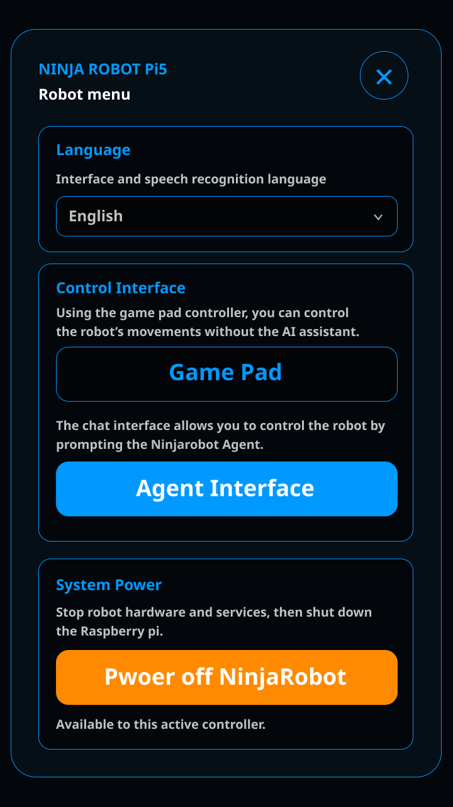
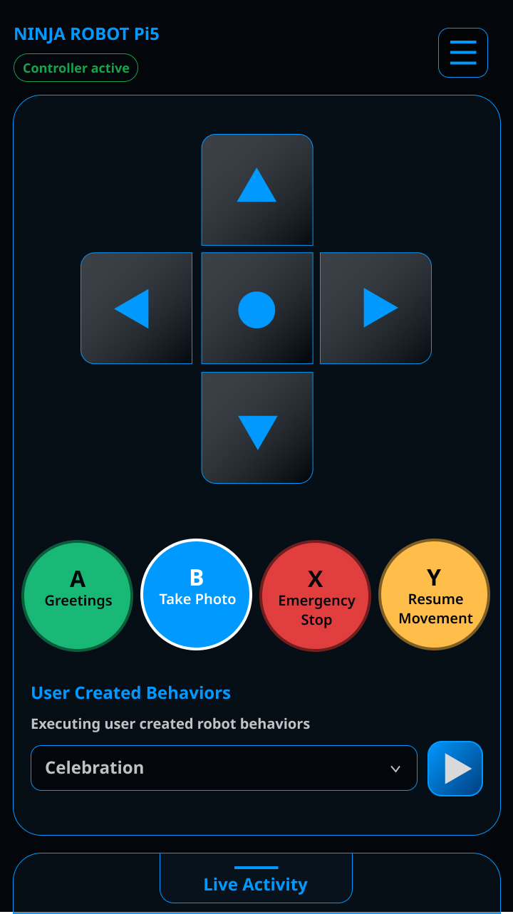
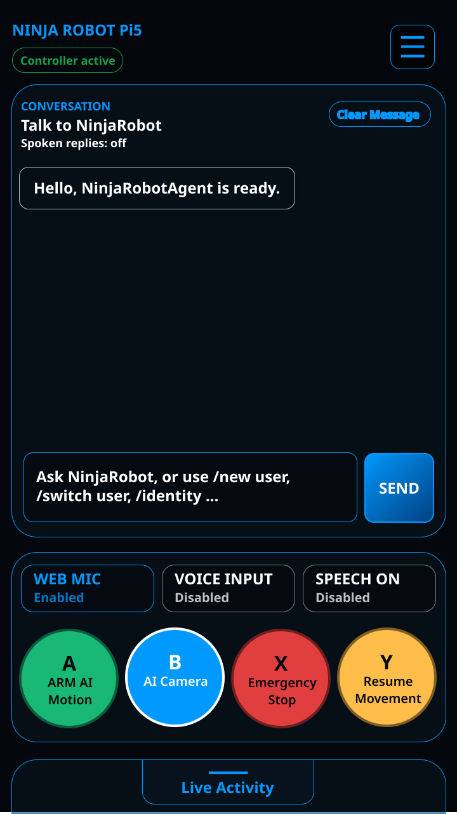

# NinjaRobotPi5

<div align="center">

**An AI-Powered Raspberry Pi 5 Robot — Talk to It, Control It, Teach It**

[](https://www.python.org/downloads/)
[](https://www.raspberrypi.com/)
[](https://ollama.com/)
[](docs/architecture/v1.0.0-support-matrix.md)
[](LICENSE)

</div>

---

**🌐 Language / 言語 / 語言 / 语言:**
[English](#english) ・ [日本語](#日本語) ・ [繁體中文](#繁體中文) ・ [简体中文](#简体中文)

---

<!-- ENGLISH -->

# English

## 1. What Is NinjaRobotPi5?

**NinjaRobotPi5** is an open-source AI robot platform built on the **Raspberry Pi 5** (a small, affordable computer about the size of a credit card). It brings together a display (the robot's face), a buzzer (for sounds and melodies), wheel servos (for movement), a distance sensor, a camera, and a microphone — all controlled through one clean software interface.

On top of the hardware, a **local AI agent** (a smart assistant program running on the Pi itself) lets you talk to the robot, type commands, or control it from your phone's web browser — all without needing any cloud service or internet connection for basic operation.

### What makes NinjaRobotPi5 special?

- **Safety-first design** — The AI can *suggest* actions (like "move forward"), but it can never directly control a motor or camera. Every physical action must pass through a safety layer, so you always stay in control.
- **Fully local AI** — The AI model runs right on your Raspberry Pi using [Ollama](https://ollama.com/). No cloud account needed for basic use.
- **Cloud optional** — Want a more powerful brain? Connect OpenAI, Gemini, or Anthropic with an API key.
- **Phone-friendly control** — Open a web browser on your phone, and you get a full game-pad controller and AI chat interface.
- **Extensible** — Add web search, calendar integration, or your own custom tools using MCP (Model Context Protocol, an open standard for connecting AI to external services).

### Who is this for?

Anyone who wants to build their own AI robot! Whether you're a student learning about robotics, a maker exploring AI, or a developer prototyping smart hardware — NinjaRobotPi5 gives you a safe, tested foundation to start from.

---

## 2. Quick Start Guide

Follow these steps to build and run your own NinjaRobotPi5 from scratch.

### 2.1 Recommended Hardware

| Component | Specification | Notes |
|---|---|---|
| **Computer** | Raspberry Pi 5 (8 GB RAM recommended) | The brain of the robot |
| **Operating System** | Raspberry Pi OS Lite 64-bit | No desktop needed — headless (no monitor) is fine |
| **Storage** | microSD card (32 GB+) or NVMe SSD | SSD gives faster AI model loading |
| **Cooling** | Active cooler (fan + heatsink) | Required — AI inference runs hot |
| **Expansion Board** | DFRobot DFR0566 IO Expansion HAT | Provides GPIO breakout and extra servo power (optional) |
| **Left Wheel Servo** | TowerPro MG90D 360° continuous rotation | Connected to GPIO12 |
| **Right Wheel Servo** | TowerPro MG90D 360° continuous rotation | Connected to GPIO13 |
| **Buzzer** | Passive buzzer | Connected to GPIO27 |
| **Distance Sensor** | VL53L0X Time-of-Flight (laser distance) | I2C bus 1 at address 0x29 |
| **Display** | ST7789V 240×320 IPS LCD | SPI0; DC=GPIO4, RST=GPIO5, BL=GPIO6 |
| **Camera** | Raspberry Pi Camera Module (OV5647) | CSI ribbon cable, 1280×720 |
| **Microphone** | USB audio input device | Any standard USB mic works |
| **Power Supply** | Chargable battery/USB Power Supply | Through Geekworm X1208 UPS board |

> **📎 Full hardware details:** See [hardware-profile.md](docs/hardware/hardware-profile.md)

### 2.2 Hardware Wiring

Below is how each component connects to the Raspberry Pi 5 through the DFR0566 expansion board:

#### Power Chain

```
┌─────────────────────────────┐
│  Official Pi 27 W USB-C     │
│  Power Supply               │
└─────────┬───────────────────┘
          ▼
┌─────────────────────────────┐
│  Geekworm X1208 UPS Board   │
│  (connects to Pi via pogo)  │
└─────────┬───────────────────┘
          ▼
┌─────────────────────────────┐
│  Raspberry Pi 5             │
│  + DFR0566 Expansion HAT    │
└─────────┬───────────────────┘
          ▼
    ┌─────┴─────┐
    ▼           ▼
 D12 Servo   D13 Servo
 (Left)      (Right)
```

#### Pin Connections

| Component | Connection Type | Pin / Address |
|---|---|---|
| Left wheel servo (red wire → D12 `+`) | Hardware PWM | GPIO12 |
| Right wheel servo (red wire → D13 `+`) | Hardware PWM | GPIO13 |
| Passive buzzer | GPIO | GPIO27 |
| VL53L0X distance sensor | I2C bus 1 | Address 0x29 |
| ST7789V display – data | SPI0 | CE0=GPIO8, MOSI=GPIO10, SCLK=GPIO11 |
| ST7789V display – control | GPIO | DC=GPIO4, RST=GPIO5, Backlight=GPIO6 |
| Camera (OV5647) | CSI ribbon cable | CSI port on Pi 5 |
| USB microphone | USB | Any USB port |

> ⚠️ **Safety reminder:** Never change wiring while the robot is powered on.

### 2.3 Raspberry Pi OS Installation

1. **Download Raspberry Pi Imager** from [raspberrypi.com/software](https://www.raspberrypi.com/software/) on your computer.
2. Insert your microSD card (or NVMe SSD) and open the Imager.
3. Choose **Raspberry Pi OS Lite (64-bit)** — no desktop is needed.
4. Click the **gear icon (⚙)** to configure:
   - Set your hostname (e.g., `ninjarobotpi5`)
   - Enable SSH (with password or key authentication)
   - Set your Wi-Fi network name and password
   - Set your username and password
5. Write the image to your storage and insert it into the Pi.
6. Power on the Pi and wait about 60 seconds.
7. From your computer, connect via SSH:

   ```bash
   ssh YOUR_USERNAME@ninjarobotpi5.local
   ```

   Replace `YOUR_USERNAME` with the username you set in the Imager.

### 2.4 Project Installation

#### Default installation (recommended)

Run this single command in your Pi's SSH terminal. It downloads and installs everything into `~/NinjaRobotPi5`:

```bash
# Preview what will happen first (nothing gets installed):
curl -fsSL https://raw.githubusercontent.com/NinjaRoboticsEducation/NinjaRobotPi5/public_v07/install.sh | bash -s -- --ref public_v07 --dry-run

# Actually install:
curl -fsSL https://raw.githubusercontent.com/NinjaRoboticsEducation/NinjaRobotPi5/public_v07/install.sh | bash -s -- --ref public_v07
```

When prompted, review the system changes and confirm. **Reboot when the installer asks**, then reconnect via SSH.

#### Custom folder installation (alternative)

If you want to install into a different location (e.g., `~/Ninja/NinjaRobotPi5`):

```bash
mkdir -p "$HOME/Ninja"
cd "$HOME/Ninja"
curl -fsSL https://raw.githubusercontent.com/NinjaRoboticsEducation/NinjaRobotPi5/public_v07/install.sh | bash -s -- --ref public_v07 --install-dir "$PWD/NinjaRobotPi5"
```

The `--install-dir` must be an absolute path that does not yet exist. Its parent folder must already exist.

#### Manual clone (alternative)

```bash
git clone https://github.com/NinjaRoboticsEducation/NinjaRobotPi5.git
cd NinjaRobotPi5
./install.sh --dry-run   # preview first
./install.sh             # then install
```

> **What the installer does:** It sets up Python 3.11 via `uv` (a fast Python package manager), installs all dependencies, creates the `ninjarobot` command, and configures system-level requirements. It does **not** download any AI model, start the robot, move any motor, or open the camera.

### 2.5 Onboarding — Set Up Your Robot

After installation and reboot, run the guided setup wizard:

```bash
ninjarobot onboard
```

The wizard shows a NINJAROBOT welcome screen and walks you through:

| Step | What happens |
|---|---|
| **1. Hardware setup** | Tests each hardware module one at a time (buzzer, display, distance sensor, servos, camera). You'll see each module's standalone test tool. |
| **2. Bluetooth speaker** *(optional)* | Pairs a Bluetooth speaker for spoken replies. |
| **3. Microphone setup** *(optional)* | Configures your USB mic for voice commands with local `whisper.cpp` (speech-to-text software). |
| **4. AI provider** | Choose between Ollama (free, local), OpenAI, Gemini, or Anthropic. |
| **5. External MCP tools** *(optional)* | Set up Tavily web search, Google Calendar, or Notion. |
| **6. Ngrok remote access** *(optional)* | Configure remote access from outside your home network. See [Appendix D](#appendix-d-ngrok-account-setup). |
| **7. Launch** | Start the robot in simulation mode (safe) or real-hardware mode. |

**Useful onboarding commands:**

```bash
ninjarobot onboard --dry-run      # Preview without changing anything
ninjarobot onboard --simulation   # Practice run without real hardware
ninjarobot onboard --resume       # Resume from where you left off
ninjarobot onboard --status       # Check current setup progress
ninjarobot onboard --step servo   # Jump to a specific step
```

> ⚠️ **Servo setup requires raised wheels!** Lift the robot so the wheels spin freely before calibrating servos.

### 2.6 Chat Interface (Terminal)

Once onboarding is complete and the Agent service is running, open the terminal chat directly.
Or run `ninjarobot-agent` to open the Interactive Tool for a menu-driven experience:

```bash
ninjarobot-agent
```

Then choose **4. Start NinjaRobot Chat Interface**.

**How to chat:**

- Type your message and press **Enter** to send.
- Press **Shift+Enter** (or **Option+Enter** on Mac) to add a new line.
- If your terminal doesn't support modifier keys, press **Esc** then **Enter** as a fallback.
- Use **arrow keys** to edit your current message before sending.
- Type `/help` to see all available commands.
- Type `/exit` to leave chat (the Agent service keeps running).

**Try these first conversations:**

```text
Hello! What can you do?
Show me a happy face.
What time is it?
```

> For a full list of all `/` commands, see [Appendix B: Chat Command Reference](#appendix-b-chat-command-reference).

### 2.7 Web Interface (Browser)

NinjaRobotPi5 has a phone-friendly web interface with two pages: a **Game Pad** for direct control and an **Agent Interface** for AI chat.

#### Launching the local web interface

**Method 1 — Through onboarding:** When onboarding finishes and you choose to launch, the HTTPS web server starts automatically.

**Method 2 — Through the Interactive Tool:**

```bash
ninjarobot-agent interactive
```

Choose **2. Start Agent Service**, then **5. Local Web Interface**.

**Method 3 — Through command line:**

```bash
# Start the Agent service first (if not already running):
ninjarobot-agent service start --real

# The web server is included — open this URL on your phone or computer:
# https://ninjarobotpi5.local:8443/
```

Your browser may show a security warning because the certificate is self-signed. This is normal on a local network — accept and continue.

#### Launching via ngrok (remote access from anywhere)

If you've configured ngrok (see [Appendix D](#appendix-d-ngrok-account-setup)):

```bash
# Configure ngrok (one-time):
ninjarobot-agent remote configure

# Activate remote access:
ninjarobot-agent remote activate

# Start the Agent service:
ninjarobot-agent service start --real

# Get your remote pairing URL:
ninjarobot-agent remote pairing-url
```

Open the pairing URL in your phone's browser. The URL is single-use — once you've paired, your browser has a secure session cookie.

> **Quick link:** For detailed ngrok account setup, see [Appendix D: Ngrok Account Setup](#appendix-d-ngrok-account-setup).

#### Web interface screens

**Launch Screen (Hamburger Menu)** — Choose your language, then select Game Pad or Agent Interface:



**Game Pad Interface** — Direct D-pad control, action buttons (Greetings, Take Photo, Emergency Stop, Resume), and user-created behaviors:



**Agent Interface** — Full AI conversation, voice controls (WEB MIC, VOICE INPUT, SPEECH ON), and hardware control buttons:



---

## 3. Key Features

### 3.1 Project File Structure

```
NinjaRobotPi5/
├── ninjarobot_pi5_agent/    # Layer 3: AI agent, chat, web, memory, providers
├── ninjarobot_pi5_ide/      # Layer 2: Hardware coordinator, safety engine
├── pi5servo/                # Layer 1: Wheel servo driver
├── pi5disp/                 # Layer 1: Display (face) driver
├── pi5buzzer/               # Layer 1: Buzzer (sound) driver
├── pi5vl53l0x/              # Layer 1: Distance sensor driver
├── pi5camera/               # Layer 1: Camera + face recognition driver
├── pi5mic/                  # Layer 1: Microphone + wake-word driver
├── ninjarobot_pi5_wiki/     # Built-in project knowledge base
├── config/                  # Default robot configuration
├── scripts/                 # Installation and maintenance scripts
├── docs/                    # Documentation, validation, architecture
├── DevelopmentPlanDoc/      # Development plans and images
├── tests/                   # Automated test suite
├── install.sh               # One-command installer
├── pyproject.toml           # Python project metadata
└── README.md                # This file
```

### 3.2 Three-Layer Architecture

NinjaRobotPi5 enforces a strict **three-layer boundary**. The AI model can never bypass the safety layer to directly control hardware.

```
┌──────────────────────────────────────────────────────────────┐
│  Layer 3 — NinjaRobot Agent                                  │
│  AI chat, web controller, memory, provider adapters, MCP     │
│  ↓ (calls only through IDE contracts — never imports pi5*)   │
├──────────────────────────────────────────────────────────────┤
│  Layer 2 — NinjaRobot IDE (safety layer)                     │
│  Capability registry, scheduler, safety engine, behaviors    │
│  ↓ (one lazy import per adapter — no direct GPIO from IDE)   │
├──────────────────────────────────────────────────────────────┤
│  Layer 1 — Managed pi5* Driver Libraries                     │
│  pi5servo · pi5disp · pi5buzzer · pi5vl53l0x                 │
│  pi5camera · pi5mic                                          │
└──────────────────────────────────────────────────────────────┘
```

**How it works:**

1. **You or the AI model** sends a command (e.g., "move forward").
2. **The Agent (Layer 3)** receives the command and translates it into a tool call.
3. **The IDE (Layer 2)** checks safety rules (Are wheels armed? Is there an obstacle?) and decides whether to allow it.
4. **The driver (Layer 1)** executes the actual hardware PWM signal to spin the servo.

The AI model can *propose* actions, but only the IDE's deterministic safety layer can *execute* them.

### 3.3 Modular Pi5 Hardware Drivers

Each `pi5*` driver is a standalone library that works independently. You can use any driver outside of NinjaRobotPi5 for your own projects.

| Driver | Description | Documentation |
|---|---|---|
| **pi5servo** | Velocity-based servo control and calibration tools. Supports MG90D continuous-rotation servos via hardware PWM. | [pi5servo/README.md](pi5servo/README.md) |
| **pi5disp** | ST7789V display driver for the robot's face screen. Supports images, text, scrolling, brightness, and rotation. | [pi5disp/README.md](pi5disp/README.md) |
| **pi5buzzer** | Passive buzzer driver for beeps, notes, and melodies. Includes named emotion sounds like `happy` and `sad`. | [pi5buzzer/README.md](pi5buzzer/README.md) |
| **pi5vl53l0x** | VL53L0X laser distance sensor driver. Supports calibration, health checks, and obstacle detection. | [pi5vl53l0x/README.md](pi5vl53l0x/README.md) |
| **pi5camera** | Camera tools with local face recognition. Captures photos, enrolls faces, and identifies known users. | [pi5camera/README.md](pi5camera/README.md) |
| **pi5mic** | Microphone tools with always-on wake-word listener. Uses `whisper.cpp` for local speech-to-text in four languages. | [pi5mic/README.md](pi5mic/README.md) |

### 3.4 NinjaRobot IDE — The Safety Layer

The **IDE** (Integrated Development Environment for the robot) sits between the AI Agent and the hardware drivers. Think of it as the robot's "safety manager."

**What the IDE does:**

- **Capability registry** — Keeps track of which hardware modules are available and healthy.
- **Safety engine** — Enforces motion arming (you must explicitly allow wheel movement each session), obstacle detection (auto-stops when something is too close), and emergency stop procedures.
- **Behavior system** — Coordinates face expressions + sounds + movement into synchronized "behaviors" like Greeting or Celebration.
- **Hardware lock** — Only one process can control the robot at a time, preventing conflicts.
- **Watchdog** — A background thread that stops the motors if the main program freezes.

**Key safety rules:**

- All commands run in **simulation mode by default**. You must add `--real` to actually move hardware.
- Motion requires explicit **arming** (`/arm` in chat).
- Camera and microphone require explicit **consent**.
- Obstacle detection auto-stops the wheels when something is within 50 mm.

### 3.5 NinjaRobot Agent — The AI Brain

The **Agent** is the AI-powered layer that understands your commands, generates responses, and coordinates with the IDE to perform actions.

**Agentic workflow pattern:**

```
You type/speak a message
         │
         ▼
  ┌─────────────┐
  │ Agent Loop   │── Sends message + tool catalog to AI model
  └──────┬──────┘
         │ Model responds with text and/or tool calls
         ▼
  ┌─────────────┐
  │ Tool Router  │── Routes tool calls to the correct provider
  └──────┬──────┘
         │ Tool results returned to model
         ▼
  ┌─────────────┐
  │ Model again  │── Generates final response
  └──────┬──────┘
         │
         ▼
  Response displayed in chat
```

**Key features:**

- **Multi-provider support** — Swap between Ollama (local), OpenAI, Gemini, or Anthropic at any time without losing your conversation or memory.
- **Tool calling** — The AI can call built-in tools (`robot.*` for hardware, `memory.*` for memory) and external MCP tools.
- **Behavior generation** — Ask the AI to create custom face + sound + movement combinations, then save them.
- **Session management** — Separate terminal and web chat sessions. Motion arming is per-session for safety.
- **Rolling context** — Long conversations are stored but each model request only sends the newest messages that fit, keeping responses fast.

### 3.6 MCP Tools and Agent Skills

#### What is MCP?

**MCP (Model Context Protocol)** is an open standard that lets AI applications connect to external data and services. Think of it as a "USB port for AI" — you plug in a tool server, and the AI can use its capabilities.

**NinjaRobotPi5 supports two types of MCP connections:**

| Type | How it works | Example |
|---|---|---|
| `streamable_http` | Connects to a hosted web service via HTTPS | Tavily web search |
| `stdio` | Runs a local program that exchanges messages | Google Calendar reader |

#### Adding an MCP tool (example: Tavily web search)

1. Create a free account at [tavily.com](https://tavily.com/) and copy your API key.
2. Stop the Agent: `ninjarobot-agent service stop`
3. Save your key privately: `ninjarobot-agent secret set TAVILY_API_KEY`
4. Add the preset: `ninjarobot-agent mcp add --preset tavily --id tavily`
5. Test it: `ninjarobot-agent mcp health tavily`
6. Restart the Agent and ask: "Search the web for the latest Raspberry Pi news"

For full MCP and Calendar setup, see [Appendix E: Google Calendar MCP Setup](#appendix-e-google-calendar-mcp-setup) and the complete [MCP and Agent Skills Tutorial](ninjarobot_pi5_wiki/raw/articles/ninjarobotpi5/2026-09-23-02/NinjaRobot_MCP_Skill.md).

#### What are Agent Skills?

**Agent Skills** are reusable, validated workflows that combine instructions with allowed tools. Think of a Skill like a recipe card — it tells the AI which tools it can use and how to use them for a specific task.

**Built-in skills include:**

- `distance-game` — Play a hand-distance sound game using the sensor and buzzer
- `robot-command-help` — Explain available chat commands
- `project-help` — Search project documentation

**To validate and use a skill:**

```bash
# List installed skills:
ninjarobot-agent skill list

# Validate a skill:
ninjarobot-agent skill validate

# Start chat with a specific skill:
ninjarobot-agent chat --skill distance-game
```

### 3.7 Memory System

NinjaRobotPi5 has a **persistent, multi-user memory** system so the robot can remember who you are, what you like, and what you've taught it.

**How it works:**

- **SQLite + FTS5** — All data is stored locally in a private SQLite database with full-text search (FTS5). No cloud, no data leaving your Pi.
- **Per-user profiles** — Each person gets their own profile with preferences, face enrollment, and conversation history.
- **Four read-only MCP tools** — The AI model can *read* memory but cannot *change* it:
  - `memory.profile.get` — Get the active user's profile
  - `memory.search` — Search through memories and preferences
  - `memory.behavior.successful` — Look up learned behaviors
  - `memory.behavior.failed` — Review failed behavior attempts
- **Bounded retrieval** — Each model request includes only relevant memories within a strict size cap, keeping responses fast.

**Default data retention:**

| Data type | Kept for |
|---|---|
| Raw conversations | 7 days |
| Failed behaviors | 180 days |
| Profiles, preferences, successful behaviors | Until you manually delete them |

**Manage memory in chat:**

```text
/memory review          # See what the robot remembers about you
/memory confirm ID      # Confirm a preference
/memory edit ID TEXT    # Correct a preference
/memory forget ID       # Remove a memory item
```

### 3.8 NinjaRobot Wiki — Built-In Knowledge Base

NinjaRobotPi5 comes with a built-in **project wiki** (a local knowledge base) inside the `ninjarobot_pi5_wiki/` folder. It contains the full manuals, architecture documentation, and development history.

**How to use it in chat:**

```text
/project How do I set up Google Calendar?
/project Explain the three-layer architecture
```

The `/project` command searches the current published manuals and returns relevant sections with source citations.

**How to use it from the terminal:**

```bash
python scripts/wiki.py search "distance sensor calibration"
```

> The wiki is read-only from chat. It never executes commands, modifies files, or accesses private data.

---

## 4. Troubleshooting (Setup Phase)

### Installation Issues

| Problem | Solution |
|---|---|
| `ninjarobot: command not found` after install | Reconnect via SSH (`exit` then `ssh` again) so the updated PATH takes effect. |
| `curl` fails with certificate error | Make sure your Pi has internet access. Try `curl -I https://github.com` to test. |
| Installer says `existing ninjarobot launcher points elsewhere` | You already have NinjaRobotPi5 installed at another location. Remove the old `~/.local/bin/ninjarobot` link first. |
| `uv` not found | Reboot and reconnect via SSH. The installer adds `uv` to your PATH but it requires a new session. |
| `--install-dir` rejected | The path must be absolute (starting with `/`), must not already exist, and its parent folder must exist. |

### Hardware Setup Issues

| Problem | Solution |
|---|---|
| Display stays blank | Check SPI is enabled: `sudo raspi-config` → Interface Options → SPI → Enable. Verify wiring: DC=GPIO4, RST=GPIO5, BL=GPIO6. |
| Buzzer makes no sound | Confirm it's a **passive** buzzer (not active). Check it's connected to GPIO27. |
| Servos don't move during calibration | Make sure wheels are raised. Check red wire goes to the `+` terminal on D12/D13. Confirm the DFR0566 board is seated properly. |
| Distance sensor not detected | Check I2C is enabled: `sudo raspi-config` → Interface Options → I2C → Enable. Run `i2cdetect -y 1` — you should see `29`. |
| Camera not found | Check the CSI ribbon cable is firmly seated. Run `rpicam-still -o test.jpg` to verify. |
| USB microphone not detected | Run `arecord -l` to list audio devices. Try a different USB port. |

### Agent Issues

| Problem | Solution |
|---|---|
| `Hardware lock held by another process` | Only one process can own the robot. Stop any other Agent instance: `ninjarobot-agent service stop` |
| `Ollama model not found` | Download a model first: `ollama pull qwen3:4b` |
| Browser can't reach `https://ninjarobotpi5.local:8443/` | Make sure the Agent is running with the web server. Check you're on the same Wi-Fi network. Try the Pi's IP address instead of `.local`. |
| SSL certificate warning in browser | This is normal — the certificate is self-signed for local use. Accept and continue. |

---

## 5. Appendix

### Appendix A: Manual Setup (Without Onboarding Tool)

If you prefer to set up each hardware module manually instead of using `ninjarobot onboard`:

**Step 1 — Test the buzzer:**

```bash
cd ~/NinjaRobotPi5
uv run --frozen pi5buzzer-tool
```

Follow the on-screen prompts to verify your buzzer works.

**Step 2 — Test the display:**

```bash
uv run --frozen pi5disp-tool
```

Follow the on-screen prompts to verify your display works.

**Step 3 — Test the distance sensor:**

```bash
uv run --frozen pi5vl53l0x-tool
```

Follow the prompts. Calibrate the sensor by following the tool's instructions.

**Step 4 — Test the servos:**

> ⚠️ **Raise the wheels first!** Lift the robot so wheels spin freely.

```bash
uv run --frozen pi5servo-tool
```

Follow the calibration wizard to find each servo's neutral point.

**Step 5 — Test the camera:**

```bash
uv run --frozen pi5camera-tool
```

Test photo capture and optional face enrollment.

**Step 6 — Import hardware settings into the robot:**

```bash
uv run --frozen ninjarobot-ide-tool
```

Choose the option to import `pi5*` settings. This copies each module's saved configuration into the robot's main config.

**Step 7 — Choose an AI provider:**

```bash
# For local Ollama (free, no API key needed):
ollama pull qwen3:4b
ninjarobot-agent model set --provider ollama --model qwen3:4b

# For cloud providers (requires an API key):
ninjarobot-agent secret set OPENAI_API_KEY
ninjarobot-agent model set --provider openai --model gpt-4o-mini
```

**Step 8 — Start the Agent:**

```bash
# Simulation mode (no hardware movement):
ninjarobot-agent service start

# Real hardware mode:
ninjarobot-agent service start --real
```

**Step 9 — Open chat:**

```bash
ninjarobot-agent chat
```

### Appendix B: Chat Command Reference

All available `/` commands in the NinjaRobot chat interface:

| Command | Description |
|---|---|
| `/help` | Show all available commands and how to use chat. |
| `/help TOPIC` | Get help about a specific topic (e.g., `/help speech`, `/help camera`). |
| `/exit` | Leave chat. The Agent service keeps running. |
| `/clear` | Clear this interface's conversation history. |
| `/status` | Show Agent, model, hardware, memory, and tool status. |
| `/time` | Show the Pi's current date, time, and timezone without calling the AI model. |
| `/arm` | Arm (allow) physical AI motion for this session. Requires typing `ARM` to confirm. |
| `/disarm` | Revoke physical AI motion for this session. |
| `/camera` | Authorize one temporary AI camera preview. |
| `/resume` | Confirm recovery after an Emergency Stop. Requires typing `RESUME`. |
| `/confirm REQUEST` | Explicitly confirm and send a request that needs confirmation. |
| `/game start [5-60]` | Start a hand-distance sound game (default 30 seconds). |
| `/game stop` | Stop the current game. |
| `/game status` | Check game status. |
| `/speech on` | Enable local spoken replies. |
| `/speech off` | Disable local spoken replies. |
| `/speech stop` | Stop current speech playback. |
| `/speech status` | Show speech configuration status. |
| `/speech outputs` | List available audio outputs. |
| `/speech en` | Switch speech to English. |
| `/speech zh` | Switch speech to Chinese. |
| `/voice input on` | Enable always-on wake-word voice input ("Hey Ninja"). |
| `/voice input off` | Disable always-on voice input. |
| `/voice input status` | Show microphone and wake-word listener status. |
| `/remind SECONDS MESSAGE` | Preview a silent local reminder. |
| `/tasks` | List local reminders and their delivery status. |
| `/tasks confirm ID` | Schedule the exact reminder you reviewed. |
| `/tasks cancel ID` | Cancel a reminder. |
| `/tasks snooze ID MINUTES` | Snooze a reminder to a new time. |
| `/remind-json JSON` | Preview a reminder with full options (title, time, repeat). |
| `/memory review` | Inspect saved information for the active user. |
| `/memory confirm ID` | Confirm a reviewed preference. |
| `/memory edit ID TEXT` | Correct and confirm a preference. |
| `/memory forget ID` | Remove a memory item. |
| `/info OPERATION {...}` | Read/preview notes, calendar, research, and briefings. |
| `/project QUESTION` | Search pinned project documentation. |
| `/recipes list` | List saved recipes. |
| `/recipes show ID` | Show a specific recipe. |
| `/recipes run ID VERSION` | Run a saved recipe. |
| `/recipes disable ID` | Disable a recipe. |
| `/new user` | Register an additional user profile and face. |
| `/switch user` | Switch to another registered user (camera verified). |
| `/identify` | Identify a registered user with the camera. |
| `/update profile` | Update the active user's name or registered face. |
| `/show remote access` | Display a fresh ngrok pairing QR code. |
| `/guide [1-5]` | Open an optional setup or safety check guide. |

### Appendix C: Key Document Links

| Document | Description |
|---|---|
| [Installation Guide](ninjarobot_pi5_wiki/raw/articles/ninjarobotpi5/2026-09-23-02/InstallationGuide.md) | Complete step-by-step guide from blank Pi to running robot |
| [Development Guide](ninjarobot_pi5_wiki/raw/articles/ninjarobotpi5/2026-09-23-02/DevelopmentGuide.md) | Architecture, API reference, and developer workflow |
| [MCP and Skills Tutorial](ninjarobot_pi5_wiki/raw/articles/ninjarobotpi5/2026-09-23-02/NinjaRobot_MCP_Skill.md) | Beginner guide to external tools and reusable Skills |
| [Development Log](ninjarobot_pi5_wiki/raw/notes/ninjarobotpi5/2026-09-23-02/DevelopmentLog.md) | Implementation history and decisions |
| [Hardware Profile](docs/hardware/hardware-profile.md) | Confirmed wiring and electrical records |
| [Documentation Index](docs/README.md) | Index of all project documents |
| [v1.0.0 Support Matrix](docs/architecture/v1.0.0-support-matrix.md) | Supported features, platforms, and known limitations |
| [Third-Party Notices](THIRD_PARTY_NOTICES.md) | Licenses for all dependencies |
| [Project Wiki](ninjarobot_pi5_wiki/README.md) | Local knowledge base for developers and AI tools |

### Appendix D: Ngrok Account Setup

[ngrok](https://ngrok.com/) lets you access your robot from outside your home network (e.g., from your office or while traveling). It creates a secure tunnel from the internet to your Pi.

#### Step 1 — Create an ngrok account

1. Go to [ngrok.com](https://ngrok.com/) and sign up for a free account.
2. After logging in, go to **Your Authtoken** in the ngrok dashboard.
3. Copy your authtoken (a long string that identifies your account).

> **Note:** ngrok has a free plan with usage limits. Check [ngrok pricing](https://ngrok.com/docs/pricing-limits/free-plan-limits) for current details.

#### Step 2 — Configure ngrok on your Pi

In your Pi's SSH terminal:

```bash
ninjarobot-agent remote configure
```

When prompted:
- Paste your ngrok authtoken (it will be hidden as you type).
- Paste it again to confirm.

This command:
- Downloads and installs the ngrok binary (one-time).
- Saves your authtoken privately in the owner-only secret store.
- Generates security tokens for browser pairing.

#### Step 3 — Activate remote access

```bash
ninjarobot-agent remote activate
```

This enables ngrok to start when you launch the Agent service.

#### Step 4 — Start the Agent and get the pairing URL

```bash
# Start the Agent service:
ninjarobot-agent service start --real

# Get your pairing URL:
ninjarobot-agent remote pairing-url
```

Open the pairing URL on your phone or computer browser. The URL works once — after pairing, your browser has a secure cookie.

#### Useful remote commands

```bash
ninjarobot-agent remote status          # Check remote access status
ninjarobot-agent remote pairing-url     # Get a new pairing URL
ninjarobot-agent remote rotate-pairing  # Revoke old browsers, get a new URL
ninjarobot-agent remote deactivate      # Stop the tunnel, revoke all sessions
```

> ⚠️ **Security:** Never share your pairing URL or screenshot it. Anyone with the URL can control your robot until the session expires or you rotate it.

### Appendix E: Google Calendar MCP Setup

Connect Google Calendar so your robot can read your schedule and create reviewed events.

#### Prerequisites

- A Google account with Google Calendar.
- A Google Cloud project (free to create).

#### Step 1 — Enable the Google Calendar API

1. Go to [Google Cloud Console](https://console.cloud.google.com/).
2. Create a new project or select an existing one.
3. Go to **APIs & Services** → **Library**.
4. Search for **Google Calendar API** and click **Enable**.

#### Step 2 — Set up the OAuth consent screen

1. Go to **APIs & Services** → **OAuth consent screen** (or **Google Auth Platform**).
2. Choose **External** user type and fill in the app name.
3. Add your Google email as a **test user** (required while the app is in testing mode).
4. Save.

#### Step 3 — Create a Desktop OAuth credential

1. Go to **APIs & Services** → **Credentials**.
2. Click **Create Credentials** → **OAuth client ID**.
3. Choose **Desktop app** as the application type.
4. Give it a name and click **Create**.
5. Click **Download JSON** to download the credential file.

#### Step 4 — Copy the credential to your Pi

Transfer the downloaded JSON file to your Pi and save it securely:

```bash
# Create the private directory:
mkdir -p "$HOME/.config/ninjarobot_pi5/google-calendar"
chmod 700 "$HOME/.config/ninjarobot_pi5/google-calendar"

# Copy your credential file (replace the source path):
scp ~/Downloads/YOUR_DOWNLOADED_FILE.json YOUR_PI_USER@YOUR_PI_HOST:~/.config/ninjarobot_pi5/google-calendar/credentials.json

# On the Pi, set the correct permissions:
chmod 600 "$HOME/.config/ninjarobot_pi5/google-calendar/credentials.json"
```

#### Step 5 — Authorize through the onboarding tool

The easiest way is through the onboarding wizard:

```bash
ninjarobot onboard --step mcp
```

Select **2** (Google Calendar). The wizard will guide you through the browser authorization.

**If your browser is on your Mac/PC** (not on the Pi), open a separate terminal and create an SSH tunnel:

```bash
ssh -N -o ExitOnForwardFailure=yes -L 127.0.0.1:8765:127.0.0.1:8765 YOUR_PI_USER@YOUR_PI_HOST
```

Keep this terminal open, then press Enter in the onboarding wizard and open the displayed URL in your Mac/PC browser.

#### Step 5 (Alternative) — Authorize via command line

```bash
# Start the Agent first:
ninjarobot-agent service start --real

# On your Mac/PC, create the SSH tunnel:
ssh -L 8765:127.0.0.1:8765 YOUR_PI_USER@YOUR_PI_HOST

# In that SSH session, run:
cd "$HOME/NinjaRobotPi5"
uv run --frozen --no-sync ninjarobot-agent calendar-connect --write
```

Open the displayed URL in your browser, approve the permissions, and wait for confirmation.

#### Step 6 — Test in chat

```text
/info calendar.connections
What is on my calendar today?
```

---

## Safety Notes

- **Never expose port 8443 to the internet** or configure router port forwarding. Use ngrok for remote access instead.
- **Raise the wheels** before any software movement test.
- **Never change wiring while the robot is powered on.**
- Camera and microphone require explicit consent from everyone nearby.
- Never share a remote pairing URL or screenshot it.

---

## License

NinjaRobotPi5 source code is licensed under the [MIT License](LICENSE).
Third-party dependencies retain the terms recorded in [Third-Party Notices](THIRD_PARTY_NOTICES.md).

<div align="center">

Made with ❤️ for AI Robotics Education and Research

</div>

---
---

<!-- 日本語 -->

# 日本語

## 1. NinjaRobotPi5 とは？

**NinjaRobotPi5** は、**Raspberry Pi 5**（クレジットカードサイズの小型コンピュータ）で動くオープンソースの AI ロボットプラットフォームです。ディスプレイ（ロボットの顔）、ブザー（音やメロディ用）、ホイールサーボ（移動用）、距離センサー、カメラ、マイクを一つのソフトウェアインターフェースで統合して制御します。

ハードウェアの上には**ローカル AI エージェント**（Pi 上で動くスマートアシスタントプログラム）が動いており、ロボットに話しかけたり、コマンドを入力したり、スマホのブラウザから操作したりできます。基本動作にクラウドサービスやインターネット接続は不要です。

### NinjaRobotPi5 の特徴

- **安全第一設計** — AI は動作を「提案」できますが、モーターやカメラを直接制御することはできません。すべての物理動作はセーフティレイヤーを通過します。
- **完全ローカル AI** — AI モデルは [Ollama](https://ollama.com/) を使って Raspberry Pi 上で直接動作。クラウドアカウント不要。
- **クラウドはオプション** — API キーで OpenAI、Gemini、Anthropic を接続可能。
- **スマホ対応操作** — スマホのブラウザでゲームパッドコントローラーと AI チャットが使えます。
- **拡張可能** — MCP（Model Context Protocol：AI を外部サービスに接続するオープン標準）でツールを追加。

---

## 2. クイックスタートガイド

### 2.1 推奨ハードウェア

| 部品 | 仕様 | 備考 |
|---|---|---|
| **コンピュータ** | Raspberry Pi 5（8 GB RAM 推奨） | ロボットの頭脳 |
| **OS** | Raspberry Pi OS Lite 64-bit | デスクトップ不要 |
| **ストレージ** | microSD（32 GB+）または NVMe SSD | SSD推奨 |
| **冷却** | アクティブクーラー（ファン＋ヒートシンク） | 必須 |
| **拡張ボード** | DFRobot DFR0566 IO Expansion HAT | サーボ電源(オプション)とGPIOピンブレイクアウト |
| **左ホイールサーボ** | TowerPro MG90D 360° 連続回転 | GPIO12 |
| **右ホイールサーボ** | TowerPro MG90D 360° 連続回転 | GPIO13 |
| **ブザー** | パッシブブザー | GPIO27 |
| **距離センサー** | VL53L0X Time-of-Flight | I2C バス 1、アドレス 0x29 |
| **ディスプレイ** | ST7789V 240×320 IPS LCD | SPI0; DC=GPIO4, RST=GPIO5, BL=GPIO6 |
| **カメラ** | Raspberry Pi カメラモジュール（OV5647） | CSI、1280×720 |
| **マイク** | USB オーディオ入力 | 標準 USB マイク |
| **電源** | 充電式リチウムイオン電池21700×1、5V/3A出力対応充電器 | Geekworm X1208 経由 |

> **📎 詳細：** [hardware-profile.md](docs/hardware/hardware-profile.md)

### 2.2〜2.7 の手順は英語版と同一です

英語版 [Section 2](#2-quick-start-guide) のコマンドをそのまま使用できます。ウィザードやチャットインターフェースは英語表示ですが、Web インターフェースは日本語を含む4言語に対応しています。

**Web インターフェース画面：**


---

## 3. 主な機能

### 3.1 三層アーキテクチャ

```
┌───────────────────────────────────────────────────────┐
│  レイヤー3 — NinjaRobot Agent                          │
│  AI チャット、Web、メモリ、プロバイダー、MCP            │
├───────────────────────────────────────────────────────┤
│  レイヤー2 — NinjaRobot IDE（セーフティレイヤー）       │
│  機能レジストリ、スケジューラー、安全エンジン           │
├───────────────────────────────────────────────────────┤
│  レイヤー1 — pi5* ドライバーライブラリ群                │
│  pi5servo · pi5disp · pi5buzzer · pi5vl53l0x          │
│  pi5camera · pi5mic                                   │
└───────────────────────────────────────────────────────┘
```

### 3.2 モジュラードライバー

| ドライバー | 説明 | ドキュメント |
|---|---|---|
| **pi5servo** | サーボ制御とキャリブレーション | [README](pi5servo/README.md) |
| **pi5disp** | ST7789V ディスプレイ | [README](pi5disp/README.md) |
| **pi5buzzer** | パッシブブザー | [README](pi5buzzer/README.md) |
| **pi5vl53l0x** | 距離センサー | [README](pi5vl53l0x/README.md) |
| **pi5camera** | カメラ＋顔認識 | [README](pi5camera/README.md) |
| **pi5mic** | マイク＋ウェイクワード | [README](pi5mic/README.md) |

### 3.3〜3.8 の詳細は英語版を参照

英語版 [Section 3](#3-key-features) に IDE、Agent、MCP、メモリシステム、Wiki の詳細説明があります。

---

## 4. トラブルシューティング

| 問題 | 解決方法 |
|---|---|
| `ninjarobot: command not found` | SSH を再接続 |
| ディスプレイが表示されない | SPI を有効化：`sudo raspi-config` → SPI |
| サーボが動かない | ホイールを持ち上げて確認 |
| 距離センサー未検出 | I2C を有効化、`i2cdetect -y 1` で確認 |
| ハードウェアロック | `ninjarobot-agent service stop` |

---

## 5. 付録

付録の詳細（手動セットアップ、チャットコマンド一覧、ngrok 設定、Google カレンダー設定）は英語版 [Section 5](#5-appendix) を参照してください。コマンドはすべて英語で共通です。

---

## 安全に関する注意事項

- ポート 8443 をインターネットに公開しないでください。
- 動作テスト前にホイールを持ち上げてください。
- 電源が入った状態で配線を変更しないでください。
- カメラとマイクの使用は近くにいる全員の同意が必要です。

---

<div align="center">

AI ロボティクス教育と研究のために ❤️ を込めて作られました

</div>

---
---

<!-- 繁體中文 -->

# 繁體中文

## 1. 什麼是 NinjaRobotPi5？

**NinjaRobotPi5** 是一個建構在 **Raspberry Pi 5**（信用卡大小的小型電腦）上的開源 AI 機器人平台。它整合了顯示螢幕（機器人的臉）、蜂鳴器（聲音）、輪子伺服馬達（移動）、距離感測器、攝影機和麥克風，透過一個軟體介面統一控制。

**本地 AI 代理**讓你可以對機器人說話、輸入指令，或從手機瀏覽器操控——基本操作不需要雲端服務或網路連線。

### 特色

- **安全優先** — AI 只能「建議」動作，所有物理動作必須通過安全層。
- **完全本地 AI** — 透過 [Ollama](https://ollama.com/) 在 Pi 上運行，不需雲端帳號。
- **雲端可選** — 可用 API 金鑰連接 OpenAI、Gemini 或 Anthropic。
- **手機友善** — 瀏覽器即可使用遊戲手把和 AI 聊天。
- **可擴充** — 用 MCP 新增網路搜尋、行事曆等工具。

---

## 2. 快速開始指南

### 2.1 推薦硬體

| 元件 | 規格 | 備註 |
|---|---|---|
| **電腦** | Raspberry Pi 5（建議 8 GB RAM） | 機器人的大腦 |
| **作業系統** | Raspberry Pi OS Lite 64-bit | 不需桌面 |
| **儲存** | microSD（32 GB+）或 NVMe SSD | SSD 更快 |
| **散熱** | 主動式散熱器 | 必需 |
| **擴充板** | DFRobot DFR0566 | 伺服電源(選配)與GPIO引腳擴展 |
| **左輪伺服** | MG90D 360° | GPIO12 |
| **右輪伺服** | MG90D 360° | GPIO13 |
| **蜂鳴器** | 被動式 | GPIO27 |
| **距離感測器** | VL53L0X | I2C 0x29 |
| **顯示螢幕** | ST7789V 240×320 | SPI0 |
| **攝影機** | OV5647 | CSI |
| **麥克風** | USB 音訊輸入 | 任意 USB |
| **電源** | 充電式鋰電池21700×1、5V/3A輸出対応充電器 | Geekworm X1208 UPS 擴展板 |

### 2.2〜2.7 步驟與英文版相同

所有命令與英文版 [Section 2](#2-quick-start-guide) 相同。Web 介面支援繁體中文。

**Web 介面畫面：**


---

## 3. 主要功能

### 三層架構

```
┌──────────────────────────────────────┐
│  第三層 — NinjaRobot Agent           │
│  AI 聊天、Web、記憶、MCP            │
├──────────────────────────────────────┤
│  第二層 — NinjaRobot IDE（安全層）   │
│  功能註冊、排程、安全引擎           │
├──────────────────────────────────────┤
│  第一層 — pi5* 驅動程式庫            │
│  pi5servo · pi5disp · pi5buzzer     │
│  pi5vl53l0x · pi5camera · pi5mic    │
└──────────────────────────────────────┘
```

### 模組化驅動

| 驅動 | 說明 | 文件 |
|---|---|---|
| **pi5servo** | 伺服馬達控制 | [README](pi5servo/README.md) |
| **pi5disp** | 顯示驅動 | [README](pi5disp/README.md) |
| **pi5buzzer** | 蜂鳴器驅動 | [README](pi5buzzer/README.md) |
| **pi5vl53l0x** | 距離感測器 | [README](pi5vl53l0x/README.md) |
| **pi5camera** | 攝影機+人臉辨識 | [README](pi5camera/README.md) |
| **pi5mic** | 麥克風+喚醒詞 | [README](pi5mic/README.md) |

其他功能詳情請參閱英文版 [Section 3](#3-key-features)。

---

## 4. 疑難排解

| 問題 | 解決方法 |
|---|---|
| `ninjarobot: command not found` | 重新連線 SSH |
| 顯示螢幕不亮 | 確認 SPI 已啟用 |
| 伺服馬達不動 | 確認輪子已抬起 |
| 距離感測器未偵測 | 啟用 I2C，執行 `i2cdetect -y 1` |
| 硬體鎖定 | `ninjarobot-agent service stop` |

---

## 5. 附錄

所有附錄內容請參閱英文版 [Section 5](#5-appendix)。命令為英文，步驟相同。

---

## 安全注意事項

- 切勿將埠 8443 暴露於網際網路。
- 動作測試前抬起輪子。
- 通電時切勿更改接線。
- 攝影機和麥克風需經同意。

---

<div align="center">

以 ❤️ 為 AI 機器人教育與研究而製作

</div>

---
---

<!-- 简体中文 -->

# 简体中文

## 1. 什么是 NinjaRobotPi5？

**NinjaRobotPi5** 是一个构建在 **Raspberry Pi 5**（信用卡大小的小型计算机）上的开源 AI 机器人平台。它整合了显示屏（机器人的脸）、蜂鸣器（声音）、轮子舵机（移动）、距离传感器、摄像头和麦克风，通过一个软件接口统一控制。

**本地 AI 代理**让你可以对机器人说话、输入命令，或从手机浏览器操控——基本操作不需要云服务或网络连接。

### 特色

- **安全优先** — AI 只能「建议」动作，所有物理动作必须通过安全层。
- **完全本地 AI** — 通过 [Ollama](https://ollama.com/) 在 Pi 上运行，不需云端账号。
- **云端可选** — 可用 API 密钥连接 OpenAI、Gemini 或 Anthropic。
- **手机友好** — 浏览器即可使用游戏手柄和 AI 聊天。
- **可扩展** — 用 MCP 添加网页搜索、日历等工具。

---

## 2. 快速开始指南

### 2.1 推荐硬件

| 组件 | 规格 | 备注 |
|---|---|---|
| **计算机** | Raspberry Pi 5（建议 8 GB RAM） | 机器人的大脑 |
| **操作系统** | Raspberry Pi OS Lite 64-bit | 不需桌面 |
| **存储** | microSD（32 GB+）或 NVMe SSD | SSD 更快 |
| **散热** | 主动散热器 | 必需 |
| **扩展板** | DFRobot DFR0566 | 舵机电源(选配)与GPIO引脚扩展 |
| **左轮舵机** | MG90D 360° | GPIO12 |
| **右轮舵机** | MG90D 360° | GPIO13 |
| **蜂鸣器** | 无源 | GPIO27 |
| **距离传感器** | VL53L0X | I2C 0x29 |
| **显示屏** | ST7789V 240×320 | SPI0 |
| **摄像头** | OV5647 | CSI |
| **麦克风** | USB 音频输入 | 任意 USB |
| **电源** | 充电式锂电池21700×1、5V/3A输出対応充電器 | Geekworm X1208 UPS 擴展板 |

### 2.2〜2.7 步骤与英文版相同

所有命令与英文版 [Section 2](#2-quick-start-guide) 相同。Web 界面支持简体中文。

**Web 界面画面：**


---

## 3. 主要功能

### 三层架构

```
┌──────────────────────────────────────┐
│  第三层 — NinjaRobot Agent           │
│  AI 聊天、Web、记忆、MCP            │
├──────────────────────────────────────┤
│  第二层 — NinjaRobot IDE（安全层）   │
│  功能注册、调度、安全引擎           │
├──────────────────────────────────────┤
│  第一层 — pi5* 驱动程序库            │
│  pi5servo · pi5disp · pi5buzzer     │
│  pi5vl53l0x · pi5camera · pi5mic    │
└──────────────────────────────────────┘
```

### 模块化驱动

| 驱动 | 说明 | 文档 |
|---|---|---|
| **pi5servo** | 舵机控制 | [README](pi5servo/README.md) |
| **pi5disp** | 显示驱动 | [README](pi5disp/README.md) |
| **pi5buzzer** | 蜂鸣器驱动 | [README](pi5buzzer/README.md) |
| **pi5vl53l0x** | 距离传感器 | [README](pi5vl53l0x/README.md) |
| **pi5camera** | 摄像头+人脸识别 | [README](pi5camera/README.md) |
| **pi5mic** | 麦克风+唤醒词 | [README](pi5mic/README.md) |

其他功能详情请参阅英文版 [Section 3](#3-key-features)。

---

## 4. 故障排除

| 问题 | 解决方法 |
|---|---|
| `ninjarobot: command not found` | 重新连接 SSH |
| 显示屏不亮 | 确认 SPI 已启用 |
| 舵机不动 | 确认轮子已抬起 |
| 距离传感器未检测 | 启用 I2C，运行 `i2cdetect -y 1` |
| 硬件锁定 | `ninjarobot-agent service stop` |

---

## 5. 附录

所有附录内容请参阅英文版 [Section 5](#5-appendix)。命令为英文，步骤相同。

---

## 安全注意事项

- 切勿将端口 8443 暴露于互联网。
- 动作测试前抬起轮子。
- 通电时切勿更改接线。
- 摄像头和麦克风需经同意。

---

<div align="center">

以 ❤️ 为 AI 机器人教育与研究而制作

</div>
